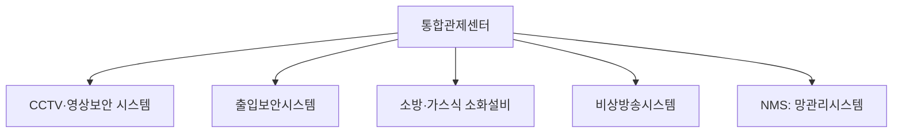
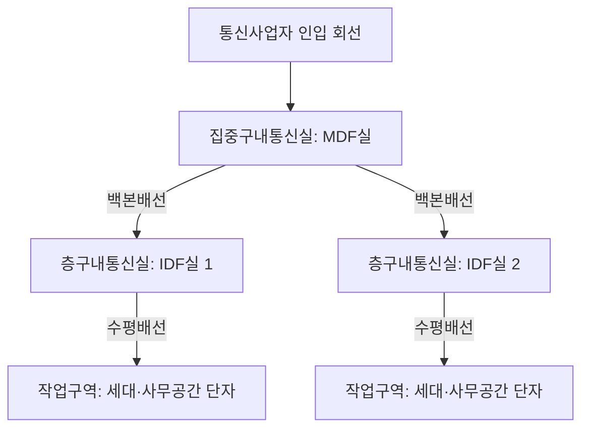

<Callout type="info">
  **이번 문서의 목표:** 방송공동수신설비를 안테나부터 세대단자함까지 구성도로 그리고 분배·분기 손실 기준을 계산하며, 통합관제·NTP·통합배선의 배선등급과 거리 규정, MDF실·IDF실 면적기준, NMS의 FCAPS 운용 항목까지 설명할 수 있게 된다.
</Callout>

## 왜 이 설비들을 한 편에 묶었는가

05편에서 패킷·IP·LAN(근거리통신망)·WAN(광역통신망)이라는 최소 어휘를 지도화했다면, 이번 편은 그 네트워크가 실제로 **건물 안에 어떻게 깔리고 운용되는가**를 다룹니다. 방송공동수신설비(TV·라디오 신호를 건물 전체에 나눠 주는 설비), 통합배선(전화·데이터 신호를 건물 곳곳에 나눠 주는 배선), 통합관제·NMS(운용 중인 설비를 감시·관리하는 체계)는 서로 다른 신호를 다루지만 "**하나의 신호원을 건물 구석구석까지 손실 없이, 규정된 기준 안에서 분배한다**"는 공통된 설계 원리를 공유합니다.

## 1. 방송공동수신설비

### 왜 필요한가

아파트나 오피스텔의 모든 세대가 각자 옥상에 안테나를 세우면 미관도 나쁘고 전파 간섭도 심해집니다. 그래서 건물 전체가 안테나 하나(또는 몇 개)를 공동으로 쓰고, 그 신호를 세대마다 나눠 주는 설비를 둡니다. 이것이 **방송공동수신설비**(공동으로 방송 신호를 수신해 나눠 주는 설비)입니다.

> **쉽게 말하면:** 건물 전체가 안테나 하나를 함께 쓰고, 그 신호를 수도관처럼 배관을 따라 각 세대로 나눠 보내는 설비입니다.

### 구성도

**헤드엔드**(head-end)는 안테나가 받은 신호를 채널별로 나누고 자동으로 이득을 조정하며, 필요하면 신호를 변환·재변조하는 방송공동수신설비의 두뇌 역할을 합니다. 신호가 동축케이블·광케이블을 지나거나 분배기·분기기를 거칠 때마다 손실이 생기므로, 손실을 되살리는 **증폭기**(amplifier)가 중간중간 들어갑니다.

### 방식별 주파수 대역

| 방식 | 명칭 | 주파수 대역(대략) | 특징 |
|------|------|---------------------|------|
| MATV | Master Antenna TV, 공동시청안테나설비 | 54–806MHz | 지상파 방송 위주의 전통적인 공동수신 방식 |
| SMATV | Satellite MATV, 위성공동수신설비 | 54–2,150MHz | 위성방송 신호까지 함께 수용해 대역이 더 넓음 |
| CATV | Cable TV, 유선방송 | 5.75–864MHz | 종합유선방송사업자가 제공하는 유선방송 신호 |

### 분배기·분기기의 손실 기준

**분배기**(splitter)는 입력 신호 하나를 둘 이상으로 나누는 장치이고, **분기기**(tap-off)는 큰 줄기(간선)에서 신호 일부를 곁가지(지선)로 떼어 내는 장치입니다. 둘 다 신호를 나누는 순간 에너지가 갈라지므로 손실(loss)이 발생하며, 이 손실은 dB(데시벨) 단위로 규정됩니다.

| 장치 | 손실 기준(대략) |
|------|-------------------|
| 2분배기(신호를 2개로 분배) | 약 4dB |
| 분기기(분기손실) | 최소 8dB부터 3dB 단위로 값이 커짐 |

**계산 감각.** 헤드엔드에서 나온 신호가 2분배기를 두 번 연속 거친다고 합시다(1대→2대→4대로 분배). 분배기 1개당 손실이 4dB이므로

$$
4\text{dB} + 4\text{dB} = 8\text{dB}
$$

**해석:** 2단으로 분배하면 손실이 단순히 더해져 총 8dB가 됩니다. 세대까지 이어지는 전체 경로의 분배기·분기기·케이블 손실을 모두 더한 값이 09편에서 다룬 총손실 계산과 같은 방식으로 누적되며, 최종적으로 세대단자함에 도달하는 신호 레벨이 수신기가 요구하는 최소 레벨 이상이 되도록 헤드엔드의 증폭기 출력을 설계합니다.

**자주 틀리는 점:** 분배기와 분기기를 같은 장치로 혼동하는 경우가 많습니다. 분배기는 "여러 갈래로 균등하게 나누는" 장치, 분기기는 "간선은 그대로 두고 일부만 옆으로 떼어 내는" 장치로 역할이 다릅니다.

## 2. 통합관제시스템과 시스템통합

### 정의

**통합관제시스템**은 CCTV(영상정보처리기기), 출입보안, 소방, 방송, 주차 등 건물 안의 여러 개별 설비를 하나의 관제센터 화면에서 통합적으로 감시·제어하는 체계입니다. 이렇게 서로 다른 제조사·프로토콜의 하위 시스템을 하나로 엮는 작업을 **시스템통합**(SI, System Integration)이라 부릅니다.

**왜 통합이 필요한가:** 화재가 나면 소방 시스템만 반응하는 것이 아니라, 그 정보를 받아 비상방송시스템이 대피 방송을 내보내고 출입보안시스템이 비상구를 자동으로 해제해야 합니다. 개별 시스템이 따로 놀면 이런 연쇄 대응이 불가능하므로, 통합관제시스템이 각 하위 시스템 사이의 신호를 중계하는 역할을 합니다.

## 3. 가스식 소화설비·비상방송시스템·출입보안시스템·NTP

### 가스식 소화설비

전산실·통신실처럼 물을 뿌리면 오히려 장비가 망가지는 공간에는 물 대신 가스를 분사해 산소 농도를 낮추거나 연쇄 연소 반응을 차단하는 **가스식 소화설비**를 설치합니다. 스프링클러 같은 습식 소화설비와 달리 통신 장비·전자기기에 직접적인 손상을 주지 않는 것이 핵심 장점입니다.

### 비상방송시스템

화재·재난 상황에서 건물 전체 또는 구역별로 대피 안내 방송을 내보내는 설비입니다. 평상시에는 일반 안내방송으로 쓰다가, 화재감지기 신호를 받으면 자동으로 비상방송으로 전환되도록 통합관제시스템과 연동하는 것이 일반적입니다.

### 출입보안시스템

카드키·생체인식(지문·안면 등)으로 출입을 통제하는 설비입니다. 화재 같은 비상 상황에서는 출입보안시스템이 자동으로 잠금을 해제해 대피로를 확보해야 하므로, 평상시의 "출입 통제" 기능과 비상시의 "대피로 확보" 기능이 통합관제 로직 안에서 함께 설계됩니다.

### 네트워크 타임 프로토콜(NTP)

**NTP**(Network Time Protocol, 네트워크 시각 동기화 프로토콜)는 네트워크로 연결된 여러 장비의 시계를 하나의 기준 시각에 맞춰 동기화하는 프로토콜입니다.

> **쉽게 말하면:** 건물 안의 모든 시계를 표준시계 하나에 맞춰 놓는 것과 같습니다.

**왜 필요한가:** CCTV 녹화 시각, 출입 기록 시각, 화재감지 시각이 장비마다 조금씩 다르면 사고가 났을 때 "무엇이 먼저 일어났는가"를 정확히 재구성할 수 없습니다. NTP는 이런 시각 불일치를 막기 위해 존재합니다.

**정의 — 스트라텀 구조.** NTP는 시각의 정확도에 따라 **스트라텀**(stratum, 층)이라는 계층 구조를 둡니다.

| 계층 | 설명 |
|------|------|
| 스트라텀 0 | 원자시계·GPS 수신기 등 가장 정확한 시각 발생원(직접 네트워크에 연결되지 않음) |
| 스트라텀 1 | 스트라텀 0에 직접 연결된 서버(1차 시각 서버) |
| 스트라텀 2 이상 | 상위 스트라텀 서버로부터 시각을 받아 오는 서버(단계가 내려갈수록 오차가 조금씩 누적) |

**자주 틀리는 점:** 스트라텀 숫자가 클수록 "더 상위"라고 착각하기 쉽지만, 반대로 **숫자가 작을수록 원본 시각원에 가까운 상위 계층**입니다.

## 4. 통합배선 — 구성도와 배선방식

### 왜 필요한가

전화선·데이터선을 그때그때 필요할 때마다 따로 깔면 배선이 뒤엉키고 유지보수가 불가능해집니다. 그래서 건물을 지을 때부터 용도에 상관없이 통일된 규격으로 배선을 미리 깔아 두고, 나중에 장비만 갈아 끼우면 되도록 설계하는 방식이 **통합배선**(structured cabling, 구조화 배선)입니다.

### 구성도

- **MDF실**(Main Distribution Frame room, 집중구내통신실): 건물 전체의 통신 회선이 처음 모이는 중심 통신실
- **IDF실**(Intermediate Distribution Frame room, 층구내통신실): 각 층이나 구역별로 MDF실의 회선을 다시 나눠 주는 중간 통신실
- **백본배선**(backbone cabling): MDF실과 IDF실 사이, 또는 IDF실 사이를 잇는 굵은 간선급 배선
- **수평배선**(horizontal cabling): IDF실에서 각 작업구역(세대·사무실 책상)까지 이어지는 배선

### 배선등급과 거리 규정

수평배선에 가장 널리 쓰이는 매체는 UTP(Unshielded Twisted Pair, 비차폐 연선) 케이블이며, 국제 배선 표준(TIA/EIA-568 계열)에서 등급별 대역폭과 최대 전송거리를 규정합니다.

| 케이블 등급 | 지원 대역폭 | 최대 지원 속도 | 채널 최대 거리 |
|-------------|-------------|-----------------|------------------|
| Cat.5e | 100MHz | 1Gbps | 100m |
| Cat.6 | 250MHz | 1Gbps(100m 기준), 10Gbps(약 55m까지) | 100m |
| Cat.6a | 500MHz | 10Gbps | 100m |

**해석:** 표의 "100m"는 우연한 숫자가 아니라, 수평배선 구간에서 통신실 쪽 배선반(패치패널)부터 작업구역 단자까지의 **채널 전체 길이**(패치코드 포함)를 100미터 이내로 제한하는 배선 표준에서 나온 규정 값입니다. 케이블 등급이 올라갈수록(Cat.5e → Cat.6 → Cat.6a) 지원 대역폭이 넓어져 더 빠른 속도를 100미터 거리 안에서도 안정적으로 지원합니다.

**자주 틀리는 점:** "Cat.6도 100미터를 지원하니 Cat.5e와 같다"고 오해하면 안 됩니다. 같은 100미터 안에서 Cat.6은 10기가비피에스(Gbps) 속도를 짧은 구간(약 55미터)까지만 보장하고, 그 이상 완전한 100미터 전 구간에서 10Gbps를 안정적으로 지원하려면 한 단계 위인 Cat.6a가 필요합니다.

### 통신접지

통신장비는 정전기·낙뢰·전위차로 인한 오작동과 감전 사고를 막기 위해 반드시 접지(grounding, 대지와 전기적으로 연결해 이상 전류를 대지로 흘려보내는 조치)를 합니다. 국내 기술기준은 통신관련시설의 접지저항을 원칙적으로 **10옴(Ω) 이하**로 유지하도록 정하며, 시설 여건상 곤란한 예외적인 경우에 한해 완화된 기준을 허용합니다. 또한 계통접지·통신접지·피뢰접지의 접지극을 하나로 묶어 접지저항 편차에 따른 전위차 문제를 없애는 **통합접지** 방식이 널리 쓰입니다.

### MDF실·IDF실 면적기준

정보통신공사업법 시행령은 건물 용도별로 구내통신실의 최소 면적과 회선 수 기준을 규정합니다.

| 기준 항목 | 내용 |
|-----------|------|
| 회선 수(주거용) | 세대당 1회선 이상(4쌍 UTP 케이블 기준) |
| 회선 수(업무용) | 업무구역 10제곱미터당 1회선 이상(4쌍 UTP 케이블 기준) |
| 층구내통신실(IDF실) 분리 설치 시 | 같은 층에 2개소 이상 나눠 설치하는 경우 각 실의 면적은 5.4제곱미터 이상 확보 |
| 집중구내통신실(MDF실) 위치 | 침수·습기 피해 우려가 적은 지상에 설치를 원칙으로 함 |

**해석:** 이 수치들은 "건물을 지을 때 통신실을 얼마나 확보해야 나중에 회선이 부족해지지 않는가"를 법으로 못 박아 둔 것입니다. 세대수가 많은 아파트일수록, 업무공간이 넓은 오피스 빌딩일수록 그만큼 MDF실·IDF실 면적도 커져야 합니다.

## 5. 망관리시스템(NMS) 운용

**NMS**(Network Management System, 망관리시스템)는 네트워크 장비의 상태를 실시간으로 감시하고, 장애를 조기에 발견해 대응하는 소프트웨어 체계입니다. 국제표준화기구(ISO)는 망관리 업무를 다섯 가지로 분류하는 **FCAPS** 모델을 제시합니다.

| 항목 | 영문 | 의미 |
|------|------|------|
| F | Fault Management(장애관리) | 장애 발생을 감지·기록하고 원인을 추적 |
| C | Configuration Management(구성관리) | 장비 설정값과 네트워크 구성 정보를 관리 |
| A | Accounting Management(계정관리) | 자원 사용량을 기록해 과금·통계에 활용 |
| P | Performance Management(성능관리) | 트래픽량·응답시간 등 성능 지표를 모니터링 |
| S | Security Management(보안관리) | 접근 통제, 침입 탐지 등 보안 관련 관리 |

**자주 틀리는 점:** FCAPS를 단순히 "장애 처리 도구"로만 좁게 이해하는 경우가 많습니다. FCAPS는 장애관리 하나만이 아니라 구성·계정·성능·보안까지 다섯 영역을 아우르는 망관리의 전체 틀입니다.

## 핵심 정리

- **방송공동수신설비**는 안테나-헤드엔드-증폭기-분배기-분기기-단자함 순서로 구성되며, MATV(54–806MHz)·SMATV(54–2,150MHz)·CATV(5.75–864MHz)로 대역이 다르고, 분배기 손실(약 4dB)·분기기 손실(8dB부터 3dB 단위)이 누적되어 전체 손실이 결정된다.
- **통합관제시스템**은 CCTV·출입보안·소방·비상방송·NMS 등 개별 시스템을 하나로 엮는 시스템통합(SI)의 결과물이며, **NTP**는 스트라텀 계층 구조로 여러 장비의 시각을 동기화한다.
- **통합배선**은 MDF실(집중구내통신실)-백본배선-IDF실(층구내통신실)-수평배선-작업구역 순서로 구성되며, UTP 케이블 등급(Cat.5e·6·6a)이 올라갈수록 100미터 거리 안에서 지원 속도가 높아진다.
- 통신접지는 원칙적으로 **10옴 이하**를 유지하며, MDF실·IDF실은 회선 수(세대당 1회선, 업무구역 10제곱미터당 1회선)와 최소 면적(분리 설치 시 5.4제곱미터 이상) 기준을 법으로 규정한다.
- **NMS**는 FCAPS(장애·구성·계정·성능·보안) 다섯 영역을 통해 네트워크를 운용·관리한다.

## 마무리 복습

<Quiz
  questionNumber={1}
  question="방송공동수신설비에서 분배기와 분기기에 대한 설명으로 옳은 것은?"
  options={['분배기는 간선에서 일부 신호만 지선으로 떼어 내는 장치다', '분기기는 입력 신호를 여러 갈래로 균등하게 나누는 장치다', '분배기는 입력 신호를 둘 이상으로 나누고 분기기는 간선에서 지선으로 신호를 나눈다', '분배기와 분기기는 완전히 같은 기능을 하는 장치다']}
  correctAnswer={3}
  explanation="분배기는 신호를 둘 이상으로 균등하게 나누는 장치이고, 분기기는 굵은 간선에서 일부 신호를 곁가지인 지선으로 떼어 내는 장치로 역할이 다르다."
  optionExplanations={['이 설명은 분기기의 역할이다.', '이 설명은 분배기의 역할이다.', '분배기와 분기기의 역할을 정확히 구분했다.', '두 장치는 신호를 나누는 방식과 목적이 서로 다르다.']}
/>

<Quiz
  questionNumber={2}
  question="MATV, SMATV, CATV 방송공동수신 방식에 대한 설명으로 가장 적절한 것은?"
  options={['MATV는 위성방송 신호까지 포함해 SMATV보다 넓은 대역을 사용한다', 'SMATV는 위성방송 신호까지 함께 수용해 MATV보다 넓은 주파수 대역을 사용한다', 'CATV는 지상파 방송만을 위한 전용 방식이다', '세 방식 모두 완전히 동일한 주파수 대역을 사용한다']}
  correctAnswer={2}
  explanation="SMATV는 위성방송 신호까지 함께 수용하므로 지상파 위주인 MATV보다 훨씬 넓은 주파수 대역(약 54~2,150MHz)을 사용한다."
  optionExplanations={['MATV는 지상파 방송 위주로 SMATV보다 좁은 대역을 사용한다.', 'SMATV가 위성방송까지 포함해 대역이 더 넓다는 설명이 정확하다.', 'CATV는 종합유선방송사업자가 제공하는 유선방송 신호를 다루는 방식이다.', '세 방식은 서로 다른 주파수 대역을 사용한다.']}
/>

<Quiz
  questionNumber={3}
  question="NTP(Network Time Protocol)의 스트라텀 구조에 대한 설명으로 옳은 것은?"
  options={['스트라텀 숫자가 클수록 원자시계 등 원본 시각원에 더 가깝다', '스트라텀 0은 원자시계·GPS 수신기 등 가장 정확한 시각 발생원을 가리킨다', '스트라텀 1은 네트워크에 전혀 연결되지 않는 장비다', '스트라텀 구조는 시각 동기화가 아니라 데이터 압축을 위한 구조다']}
  correctAnswer={2}
  explanation="스트라텀 0은 원자시계나 GPS 수신기처럼 가장 정확한 시각 발생원을 가리키며, 스트라텀 1은 이에 직접 연결된 1차 시각 서버다."
  optionExplanations={['스트라텀은 숫자가 작을수록 원본 시각원에 가까운 상위 계층이다.', '스트라텀 0에 대한 정확한 설명이다.', '스트라텀 1은 스트라텀 0에 직접 연결된 네트워크 서버다.', 'NTP는 여러 장비의 시각을 동기화하기 위한 프로토콜이다.']}
/>

<Quiz
  questionNumber={4}
  question="Cat.6a UTP 케이블에 대한 설명으로 가장 적절한 것은?"
  options={['100메가헤르츠 대역폭으로 최대 1Gbps만 지원한다', '500메가헤르츠 대역폭을 지원하며 100미터 전 구간에서 10Gbps를 안정적으로 지원한다', 'Cat.5e보다 지원 대역폭이 좁다', '수평배선이 아니라 백본배선 전용으로만 사용된다']}
  correctAnswer={2}
  explanation="Cat.6a는 500MHz 대역폭을 지원하며, Cat.6과 달리 100미터의 전체 채널 구간에서도 10Gbps 속도를 안정적으로 지원한다."
  optionExplanations={['100MHz 대역폭에 1Gbps는 Cat.5e에 대한 설명이다.', 'Cat.6a의 대역폭과 성능을 정확히 설명했다.', 'Cat.6a는 Cat.5e보다 대역폭이 훨씬 넓다.', 'UTP 케이블은 수평배선에 널리 쓰이는 매체다.']}
/>

<Quiz
  questionNumber={5}
  question="통신설비의 접지저항 기준에 대한 설명으로 가장 적절한 것은?"
  options={['통신관련시설의 접지저항은 원칙적으로 10옴 이하를 유지하도록 정한다', '접지저항은 높을수록 안전하므로 상한선이 없다', '통신접지는 계통접지·피뢰접지와 절대 통합할 수 없다', '접지저항 기준은 통신설비와 무관한 규정이다']}
  correctAnswer={1}
  explanation="통신관련시설의 접지저항은 원칙적으로 10옴 이하를 유지하도록 기술기준에서 정하며, 시설 여건상 곤란한 경우에 한해 예외를 허용한다."
  optionExplanations={['접지저항 기준을 정확히 설명했다.', '접지저항은 낮을수록 이상 전류가 대지로 잘 흘러 안전하다.', '계통접지·통신접지·피뢰접지를 하나로 묶는 통합접지 방식이 널리 쓰인다.', '접지저항 기준은 통신설비 안전과 직접 관련된 규정이다.']}
/>

<Quiz
  questionNumber={6}
  question="정보통신공사업법 시행령상 구내통신실 관련 기준으로 옳은 것은?"
  options={['업무용 건축물의 회선 수는 세대당 1회선 이상(4쌍 UTP) 기준을 따른다', '주거용 건축물의 회선 수는 업무구역 10제곱미터당 1회선 이상 기준을 따른다', '층구내통신실을 같은 층에 2개소 이상 분리 설치할 때 각 실은 5.4제곱미터 이상을 확보해야 한다', '집중구내통신실은 침수 우려가 있는 지하 공간에 설치하는 것을 원칙으로 한다']}
  correctAnswer={3}
  explanation="층구내통신실(IDF실)을 같은 층에 2개소 이상 분리 설치하는 경우 각 실의 면적은 5.4제곱미터 이상을 확보해야 한다."
  optionExplanations={['세대당 1회선 기준은 업무용이 아니라 주거용 건축물에 적용된다.', '업무구역 10제곱미터당 1회선 기준은 주거용이 아니라 업무용 건축물에 적용된다.', '층구내통신실 분리 설치 시 면적 기준을 정확히 설명했다.', '집중구내통신실은 침수·습기 피해 우려가 적은 지상 설치를 원칙으로 한다.']}
/>

<Quiz
  questionNumber={7}
  question="망관리시스템(NMS)의 FCAPS 모델에서 트래픽량과 응답시간을 모니터링하는 항목은?"
  options={['Fault Management(장애관리)', 'Accounting Management(계정관리)', 'Performance Management(성능관리)', 'Security Management(보안관리)']}
  correctAnswer={3}
  explanation="Performance Management(성능관리)는 트래픽량·응답시간 등 네트워크 성능 지표를 모니터링하는 FCAPS의 항목이다."
  optionExplanations={['장애관리는 장애 발생을 감지·기록하고 원인을 추적하는 항목이다.', '계정관리는 자원 사용량을 기록해 과금·통계에 활용하는 항목이다.', '성능관리에 대한 정확한 설명이다.', '보안관리는 접근 통제·침입 탐지 등을 다루는 항목이다.']}
/>

## 참고 자료

- [계명대학교 게시판 - 정보통신기사 출제기준(필기·실기) PDF](https://cms.kmu.ac.kr/bbs/computer/763/172569/download.do)
- [정보통신신문 - 방송공동수신설비의 이해②](https://www.koit.co.kr/news/articleView.html?idxno=33149)
- [국가법령정보센터 - 정보통신공사업법 시행령](https://law.go.kr/LSW/lsInfoP.do?lsiSeq=284859)
- [국가법령정보센터 - 접지설비ㆍ구내통신설비ㆍ선로설비 및 통신공동구등에 대한 기술기준](https://www.law.go.kr/LSW/admRulLsInfoP.do?admRulSeq=2100000196201)
