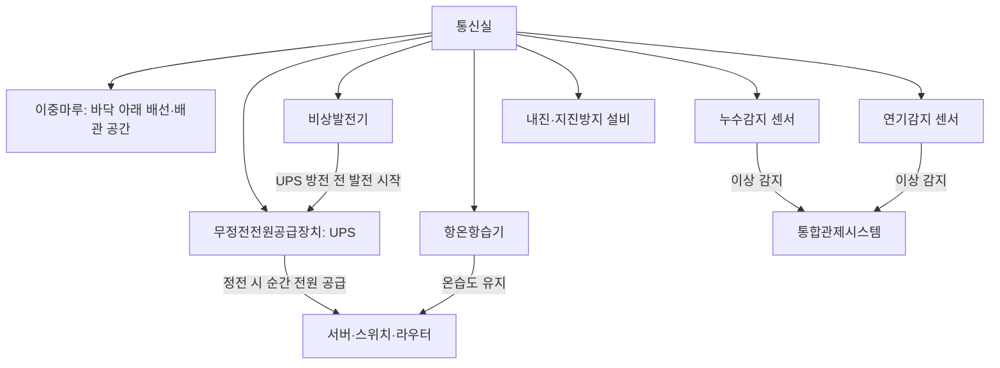
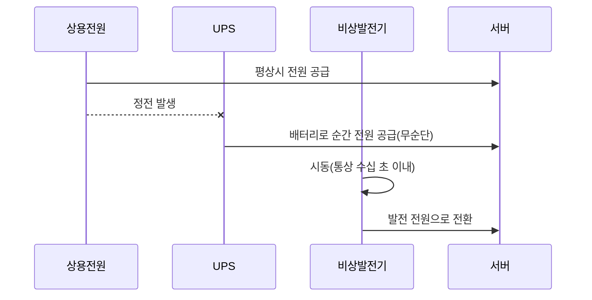
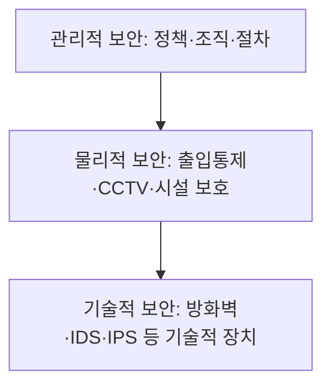

## 왜 통신실에는 별도의 설비가 필요한가

22편에서 MDF실(집중구내통신실)·IDF실(층구내통신실)의 면적 기준을 다뤘습니다. 그런데 통신 장비는 단순히 "방 하나"만 있으면 되는 것이 아닙니다.

## 1. 구내통신 설비의 구성

```mermaid
graph TD
  R[통신실] --> F[이중마루: 바닥 아래 배선·배관 공간]
  R --> U[무정전전원공급장치: UPS]
  R --> A[항온항습기]
  R --> G[비상발전기]
  R --> S1[누수감지 센서]
  R --> S2[연기감지 센서]
  R --> E[내진·지진방지 설비]
  S1 -->|이상 감지| ALARM[통합관제시스템]
  S2 -->|이상 감지| ALARM
  U -->|정전 시 순간 전원 공급| SERVER[서버·스위치·라우터]
  G -->|UPS 방전 전 발전 시작| U
  A -->|온습도 유지| SERVER
```

### 이중마루(access floor, 이중바닥)

**이중마루**는 건물의 원래 바닥 위에 일정 높이의 지지대를 세우고 그 위에 패널을 깔아, 패널과 원래 바닥 사이에 빈 공간을 만드는 구조입니다. 이 빈 공간에 전원 케이블·통신 케이블·냉각용 배관을 통과시켜, 바닥 위로 케이블이 어지럽게 널리지 않게 하고 필요할 때 패널만 들어내 배선을 손쉽게 추가·정비할 수 있습니다.

**자주 틀리는 점:** 이중마루를 단순한 "미관용 바닥재"로 오해하는 경우가 있습니다. 실제로는 배선 정리와 공조(냉각 공기 순환) 두 가지 기능을 겸하는 설비입니다.

### 무정전전원공급장치(UPS)

**UPS**(Uninterruptible Power Supply, 무정전전원공급장치)는 정전이 발생한 순간부터 비상발전기가 정상 가동할 때까지의 짧은 공백 시간 동안 배터리로 전원을 공급해, 서버·스위치가 순간적으로 꺼지지 않도록 하는 장치입니다.

```mermaid
sequenceDiagram
  participant 상용전원
  participant UPS
  participant 비상발전기
  participant 서버
  상용전원->>서버: 평상시 전원 공급
  상용전원--xUPS: 정전 발생
  UPS->>서버: 배터리로 순간 전원 공급(무순단)
  비상발전기->>비상발전기: 시동(통상 수십 초 이내)
  비상발전기->>서버: 발전 전원으로 전환
```

**해석:** UPS의 배터리 용량은 무한하지 않습니다. UPS는 "정전과 동시에 서버가 꺼지는 순간의 공백"만 메워 주는 다리 역할이고, 장시간 정전에 대비하는 것은 뒤이어 가동되는 비상발전기의 몫입니다. 이 두 설비가 이어달리기하듯 역할을 넘겨받는 구조를 이해하는 것이 핵심입니다.

### 항온항습기

**항온항습기**는 통신실 내부의 온도와 습도를 24시간 감지해 일정한 범위 안으로 유지하는 공조 장비입니다. 업계에서는 통상 온도 섭씨 16–28도, 상대습도 40–70퍼센트 범위를 통신 장비의 안정적인 운용 기준으로 삼습니다.

| 항목 | 통상 유지 범위 | 벗어나면 생기는 문제 |
|------|------------------|-------------------------|
| 온도 | 섭씨 16–28도 | 과열로 인한 오작동, 부품 수명 단축 |
| 습도 | 상대습도 40–70퍼센트 | 습도가 낮으면 정전기로 인한 회로 손상, 높으면 결로로 인한 합선 위험 |

**자주 틀리는 점:** "습도는 낮을수록 안전하다"고 생각하기 쉽지만, 습도가 지나치게 낮으면 오히려 정전기가 잘 발생해 반도체 부품에 손상을 줄 수 있습니다. 항온항습기는 너무 습하지도, 너무 건조하지도 않은 범위를 함께 관리합니다.

### IBS망(지능형 빌딩 시스템)

**IBS**(Intelligent Building System, 지능형 빌딩 시스템)는 건물 안의 정보통신·사무자동화·설비자동화·보안 시스템을 하나로 유기적으로 통합해, 경제성·효율성·안전성을 높이는 건물 운영 체계입니다.

| 구성 부문 | 영문 약어 | 역할 |
|-----------|-----------|------|
| 정보통신 부문 | CA(Communication Automation) | 전화·데이터·영상 등 통신 인프라 제공 |
| 사무자동화 부문 | OA(Office Automation) | 문서·업무 처리의 전산화 지원 |
| 빌딩자동화 부문 | BA(Building Automation) | 냉난방·조명·엘리베이터 등 설비 제어 |
| 통합보안 부문 | SA(Security Automation) | 출입통제·CCTV 등 보안설비 통합 |
| 시스템통합 부문 | SI(System Integration) | 위 부문들을 하나의 체계로 엮는 통합 설계 |
| 시설관리 부문 | FA(Facility management Automation) | 설비의 유지보수·에너지 관리 |

**해석:** IBS는 22편의 통합관제시스템을 건물 전체 스케일로 확장한 개념입니다. 통합관제시스템이 "감시와 제어의 화면"에 초점을 둔다면, IBS는 그 화면 뒤에 있는 통신·사무·설비·보안 인프라 전체의 설계 철학을 가리킵니다.

### 누수감지·연기감지·비상발전기·지진방지대책

- **누수감지 센서**: 통신실 바닥(특히 이중마루 아래)에 물이 스며들면 즉시 감지해 경보를 울리는 센서. 냉각수 배관이 지나가는 통신실에서 특히 중요합니다.
- **연기감지 센서**: 화재 초기의 연기를 감지해 가스식 소화설비(22편) 작동의 신호가 되는 센서.
- **비상발전기**: 장시간 정전에 대비해 UPS의 배터리가 소진되기 전에 자체적으로 전력을 생산하는 설비.
- **지진방지대책**: 랙(rack, 장비를 세워 넣는 선반)과 바닥을 고정하는 내진 브래킷, 장비 전도 방지 스토퍼 등으로 지진 시 장비 낙하·전도를 막는 대책.

## 2. 관리적·물리적 보안

### 정의

정보보안은 흔히 세 층위로 나눠 설계합니다.

```mermaid
graph TD
  A[관리적 보안: 정책·조직·절차] --> B[물리적 보안: 출입통제·CCTV·시설 보호]
  B --> C[기술적 보안: 방화벽·IDS·IPS 등 기술적 장치]
```

**관리적 보안**은 보안 정책 수립, 조직 구성, 정기 점검·교육 같은 "사람과 절차"에 관한 보안입니다. 대표적으로 **ISMS**(Information Security Management System, 정보보호관리체계)는 조직이 정보보호를 위한 관리적·기술적·물리적 보호조치를 체계적으로 갖췄는지 심사해 인증하는 제도입니다.

**망분리**(network segregation)는 업무망과 인터넷망을 아예 분리해, 인터넷을 통한 침입 경로 자체를 차단하는 대표적인 관리적·기술적 보안 조치입니다.

| 망분리 방식 | 설명 |
|--------------|------|
| 물리적 망분리 | 업무용 PC와 인터넷용 PC를 아예 다른 회선·다른 장비로 분리 |
| 논리적 망분리 | 같은 물리 회선 위에서 가상화 기술(VLAN, 가상 데스크톱 등)로 논리적으로만 분리 |

**물리적 보안**은 출입통제 시스템, CCTV(영상정보처리기기) 같은 실제 시설·장비를 통한 보안입니다. 22편에서 다룬 출입보안시스템과 통합관제시스템이 여기 해당합니다.

## 3. 기술적 보안 — 공격 유형과 방어 장비

### 대표적인 공격 유형

| 공격 | 정의 |
|------|------|
| 스니핑(sniffing) | 네트워크를 지나가는 패킷을 몰래 엿보아 정보를 가로채는 공격(도청) |
| 스푸핑(spoofing) | 송신지 주소나 신원을 위조해 마치 신뢰할 수 있는 상대인 것처럼 속이는 공격 |
| DDoS(Distributed Denial of Service, 분산서비스거부공격) | 다수의 장비를 동원해 트래픽을 폭주시켜 정상 서비스를 마비시키는 공격 |
| APT(Advanced Persistent Threat, 지능형 지속 위협) | 특정 대상을 노려 장기간에 걸쳐 은밀하게 침투·정보 탈취를 시도하는 공격 |

### 방어 장비

| 장비 | 영문 | 방어 방식 |
|------|------|-----------|
| 방화벽(firewall) | Firewall | 미리 정한 규칙(IP·포트 등)에 따라 트래픽을 허용하거나 차단 |
| 침입탐지시스템(IDS) | Intrusion Detection System | 비정상 트래픽을 탐지해 관리자에게 알림(차단은 하지 않음) |
| 침입방지시스템(IPS) | Intrusion Prevention System | 비정상 트래픽을 탐지함과 동시에 실시간으로 차단까지 수행 |
| 무선침입방지시스템(WIPS) | Wireless Intrusion Prevention System | 무단 무선 접속점(AP)이나 무선 공격을 탐지·차단 |
| 통합위협관리(UTM) | Unified Threat Management | 방화벽·IDS/IPS·안티바이러스 등 여러 보안 기능을 하나의 장비로 통합 |

**해석:** IDS와 IPS는 이름이 비슷해 자주 혼동됩니다. **IDS는 탐지만 하고 사람이 판단해 대응**하는 반면, **IPS는 탐지와 동시에 스스로 차단까지 수행**합니다. UTM은 이런 개별 장비들을 하나로 합쳐 도입·관리 비용을 줄인 통합형 장비입니다.

**자주 틀리는 점:** WIPS를 IPS의 하위 개념으로만 이해하고 "무선망에도 그냥 IPS를 쓰면 된다"고 생각하기 쉽습니다. 하지만 무선 환경은 유선과 달리 물리적인 케이블 없이 전파로 통신하므로, 가짜 접속점(rogue AP)처럼 유선 IPS가 다루지 않는 무선 고유의 위협까지 별도로 탐지해야 하기 때문에 WIPS라는 전용 장비가 따로 존재합니다.

## 핵심 정리

- **이중마루**는 배선 정리와 냉각 공기 순환을 겸하는 통신실 바닥 구조이며, **UPS**는 정전 순간부터 비상발전기가 가동할 때까지의 공백을 메우는 다리 역할을 한다.
- **항온항습기**는 통상 온도 섭씨 16–28도, 습도 40–70퍼센트 범위를 유지해 과열·정전기·결로를 함께 예방한다.
- **IBS**는 정보통신(CA)·사무자동화(OA)·빌딩자동화(BA)·통합보안(SA)·시스템통합(SI)·시설관리(FA) 여섯 부문을 통합한 건물 운영 체계다.
- 보안은 **관리적 보안**(정책·ISMS·망분리)-**물리적 보안**(출입통제·CCTV)-**기술적 보안**(방화벽·IDS·IPS 등) 3단계로 설계한다.
- 스니핑·스푸핑·DDoS·APT는 대표적인 공격 유형이며, **IDS는 탐지만**, **IPS는 탐지와 차단을 함께** 수행하고, UTM은 여러 보안 기능을 하나로 통합한 장비다.

## 마무리 복습

<Quiz
  questionNumber={1}
  question={"이중마루(access floor)에 대한 설명으로 가장 적절한 것은?"}
  options={["미관을 위한 바닥재일 뿐 배선이나 냉각과는 무관하다","패널 아래 빈 공간에 배선과 냉각 배관을 통과시켜 배선 정리와 공조 기능을 겸한다","이중마루는 통신실이 아니라 사무공간에만 설치된다","이중마루는 정전 시 전원을 공급하는 설비다"]}
  correctAnswer={2}
  explanation={"이중마루는 바닥 아래 빈 공간에 케이블과 냉각 배관을 통과시켜 배선 정리와 공기 순환을 함께 담당하는 통신실 설비다."}
/>

<Quiz
  questionNumber={2}
  question={"UPS와 비상발전기의 관계에 대한 설명으로 옳은 것은?"}
  options={["UPS는 장시간 정전에도 무한히 전원을 공급할 수 있다","UPS는 정전 순간부터 비상발전기가 정상 가동할 때까지의 짧은 공백을 메운다","비상발전기가 먼저 작동하고 그 이후에 UPS가 작동한다","UPS와 비상발전기는 동시에 필요 없는 중복 설비다"]}
  correctAnswer={2}
  explanation={"UPS는 정전 발생과 동시에 배터리로 전원을 공급해 비상발전기가 시동을 걸어 정상 가동할 때까지의 짧은 공백을 메우는 역할을 한다."}
/>

<Quiz
  questionNumber={3}
  question={"항온항습기가 유지하는 통신실 환경 기준으로 가장 적절한 것은?"}
  options={["온도는 낮을수록, 습도는 0퍼센트에 가까울수록 좋다","통상 온도 섭씨 16~28도, 습도 40~70퍼센트 범위를 유지한다","습도는 관리 대상이 아니며 온도만 관리하면 충분하다","온도와 습도 모두 상한선 없이 높을수록 안전하다"]}
  correctAnswer={2}
  explanation={"항온항습기는 통상 온도 섭씨 16~28도, 상대습도 40~70퍼센트 범위를 유지해 과열과 정전기, 결로를 함께 예방한다."}
/>

## 참고 자료

- [계명대학교 게시판 - 정보통신기사 출제기준(필기·실기) PDF](https://cms.kmu.ac.kr/bbs/computer/763/172569/download.do)
- [디지털타임스 - 지능형빌딩시스템(IBS)](https://dt.co.kr/contents.html?article_no=2010081602011832754002)
- [STEVEN J. LEE - 데이터센터/서버룸의 적정 온도와 적정 습도](https://www.stevenjlee.net/2020/02/22/%EC%9D%B4%ED%95%B4%ED%95%98%EA%B8%B0-%EB%8D%B0%EC%9D%B4%ED%84%B0%EC%84%BC%ED%84%B0-%EC%84%9C%EB%B2%84%EB%A3%B8%EC%9D%98-%EC%A0%81%EC%A0%95-%EC%98%A8%EB%8F%84%EC%99%80-%EC%A0%81%EC%A0%95-%EC%8A%B5/)
