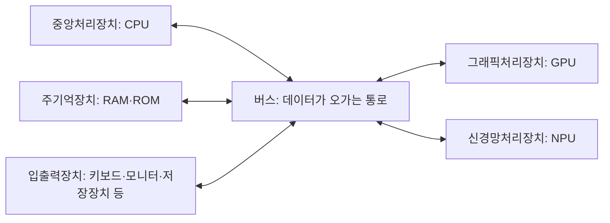
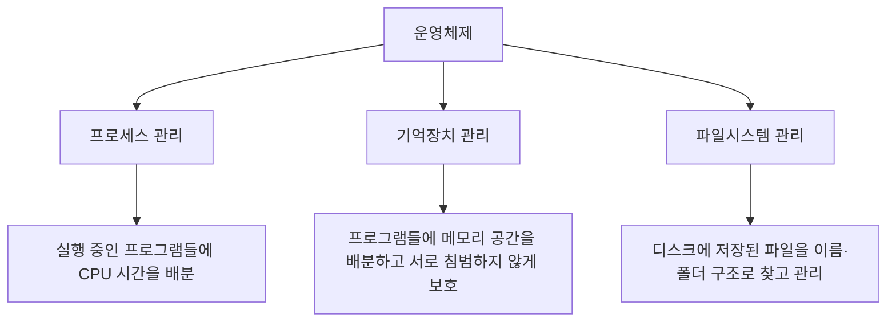
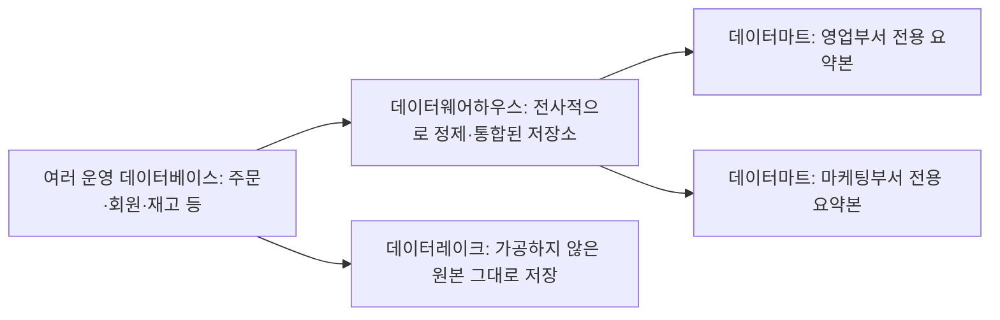

<Callout type="info">
  **이번 문서의 목표:** 프로세서·기억장치·입출력장치의 역할을 블록도로 구분하고, 운영체제의 세 가지 핵심 관리 기능을 설명하며, OSI·TCP/IP·IPv4/IPv6의 차이와 데이터웨어하우스·데이터마트·데이터레이크의 관계를 설명할 수 있게 된다.
</Callout>

## 왜 이 편은 "요약 지도"인가

04편에서 중앙처리장치·기억장치·입출력장치라는 컴퓨터 구조의 최소 용어를, 05편에서 패킷·IP 주소·LAN(근거리통신망)·WAN(광역통신망)이라는 네트워크의 최소 용어를 지도화했습니다. 이번 편은 그 지도 위에 최신 하드웨어(NPU·HBM 등)와 운영체제·네트워크·빅데이터의 핵심 개념을 얹어 "컴퓨터일반" 과목 전체를 한 번에 훑는 요약 편입니다. 서버 구축·가상화·클라우드처럼 이미 20·21편에서 실무 관점으로 깊게 다룬 내용은 이 편에서 다시 설명하지 않고 해당 편을 참고하도록 안내합니다.

## 1. 프로세서 — CPU·GPU·NPU

### 컴퓨터의 기본 블록도

### 세 프로세서의 역할 차이

**CPU**(Central Processing Unit, 중앙처리장치)는 명령어를 하나씩 순서대로 해석하고 실행하는 데 특화된 범용 처리장치입니다. 복잡한 분기·조건 판단이 잦은 일반적인 프로그램 실행에 적합합니다.

**GPU**(Graphics Processing Unit, 그래픽처리장치)는 원래 화면의 수많은 점(픽셀)을 동시에 계산하기 위해 만들어졌습니다. 같은 종류의 단순한 연산을 **동시에 아주 많이** 처리하는 병렬 연산에 특화되어, 오늘날에는 인공지능 모델 학습처럼 대량의 행렬 연산이 필요한 작업에도 널리 쓰입니다.

**NPU**(Neural Processing Unit, 신경망처리장치)는 인공신경망 연산(딥러닝의 곱셈·덧셈 반복 연산)만을 겨냥해 설계된 전용 처리장치입니다. 범용성은 CPU보다 떨어지지만, 신경망 연산 하나만 놓고 보면 GPU보다도 전력 효율이 뛰어납니다.

| 구분 | CPU | GPU | NPU |
|------|-----|-----|-----|
| 강점 | 복잡한 분기·순차 처리 | 대량의 단순 연산을 동시에 처리 | 신경망 연산 전용 고효율 처리 |
| 코어 구조 | 소수의 강력한 코어 | 수천 개의 작은 코어 | 신경망 연산에 최적화된 전용 회로 |
| 대표 활용 | 운영체제 구동, 일반 애플리케이션 | 그래픽 렌더링, 인공지능 학습 | 인공지능 추론(스마트폰·엣지 기기) |

> **쉽게 말하면:** CPU는 한 사람이 복잡한 일을 순서대로 처리하는 만능 일꾼, GPU는 같은 단순 작업을 동시에 처리하는 수천 명의 작업자 집단, NPU는 신경망 계산 하나만 아주 잘하도록 특훈받은 전문가입니다.

## 2. 기억장치 — RAM·ROM·HBM

| 종류 | 영문 | 휘발성 | 특징 |
|------|------|--------|------|
| RAM | Random Access Memory, 임의접근기억장치 | 휘발성(전원이 꺼지면 내용 소실) | CPU가 지금 실행 중인 프로그램과 데이터를 담는 주기억장치 |
| ROM | Read Only Memory, 읽기전용기억장치 | 비휘발성(전원이 꺼져도 내용 유지) | 부팅에 필요한 초기 명령어(펌웨어) 등을 저장 |
| HBM | High Bandwidth Memory, 고대역폭 메모리 | 휘발성 | 메모리 칩을 수직으로 쌓아 GPU·NPU 옆에 붙여, 매우 넓은 대역폭으로 데이터를 주고받는 고성능 메모리 |

**왜 HBM이 따로 필요한가:** GPU·NPU처럼 한 번에 엄청난 양의 데이터를 주고받는 프로세서 옆에 일반 RAM을 두면, 프로세서의 연산 속도를 메모리가 따라가지 못하는 병목(bottleneck)이 생깁니다. HBM은 여러 층의 메모리를 수직으로 쌓고 매우 넓은 통로로 프로세서와 직접 연결해 이 병목을 줄인 메모리입니다.

**자주 틀리는 점:** ROM을 "한 번 쓰면 절대 못 바꾸는 메모리"로 단정하면 안 됩니다. 요즘은 전기적으로 다시 쓸 수 있는 ROM(플래시 메모리 계열)이 널리 쓰이며, ROM의 핵심 성질은 "수정 불가"가 아니라 "전원이 꺼져도 내용이 유지되는 비휘발성"입니다.

## 3. 운영체제(OS)의 세 가지 관리 기능

04편에서 운영체제(Operating System, OS)를 "컴퓨터 자원을 관리하고 사용자에게 실행 환경을 제공하는 소프트웨어"로 소개했습니다. 이 관리 기능은 크게 세 가지로 나뉩니다.

| 관리 기능 | 핵심 역할 |
|-----------|-----------|
| 프로세스 관리 | 실행 중인 프로그램(프로세스)에 CPU 시간을 나눠 주는 스케줄링 수행 |
| 기억장치 관리 | 여러 프로세스에 메모리 공간을 배분하고, 서로의 영역을 침범하지 못하도록 보호 |
| 파일시스템 관리 | 디스크의 데이터를 파일·폴더 단위로 정리해 찾고 저장할 수 있게 함 |

**자주 틀리는 점:** 운영체제의 역할을 "프로그램을 실행해 주는 것"으로만 뭉뚱그려 이해하면 안 됩니다. 시험에서는 이 세 가지 관리 기능을 구분해서 묻는 문제가 자주 나오므로, "무엇을(프로세스·메모리·파일) 어떻게 배분·보호·정리하는가"를 각각 구분해 기억해야 합니다. 각 기능의 세부 알고리즘(스케줄링 기법, 가상메모리 등)은 이 과목이 아니라 독학사 컴퓨터구조·운영체제 과목이 다루는 영역이므로 여기서는 반복하지 않습니다.

## 4. 네트워크 일반 — OSI·TCP/IP·IPv4·IPv6

### OSI 7계층과 TCP/IP의 대응

국제표준화기구(ISO)가 정한 **OSI**(Open Systems Interconnection, 개방형 시스템 상호연결) 참조모델은 통신 과정을 7개 계층으로 나눠 설명합니다. 인터넷에서 실제로 쓰이는 **TCP/IP**(Transmission Control Protocol/Internet Protocol) 모델은 이를 4개 계층으로 단순화한 실무 표준입니다.

| OSI 7계층 | 계층별 역할(요약) | TCP/IP 4계층 |
|-----------|---------------------|----------------|
| 7. 응용계층 | 사용자가 직접 접하는 서비스(웹·메일 등) | 응용계층 |
| 6. 표현계층 | 데이터 형식 변환·암호화 | 응용계층 |
| 5. 세션계층 | 통신 세션의 시작·유지·종료 | 응용계층 |
| 4. 전송계층 | 종단 간 신뢰성 있는 전달(포트 번호 사용) | 전송계층 |
| 3. 네트워크계층 | 경로 선택과 주소 지정(IP 주소 사용) | 인터넷계층 |
| 2. 데이터링크계층 | 인접 장비 간 오류 없는 전달(MAC 주소 사용) | 네트워크접속계층 |
| 1. 물리계층 | 전기 신호·광신호로 실제 전송 | 네트워크접속계층 |

**해석:** OSI는 계층을 세분화해 설명하기 좋은 "교과서용 모델"이고, TCP/IP는 실제 인터넷 장비들이 동작하는 "실무용 모델"입니다. 각 계층의 구체적인 동작 방식(라우팅 프로토콜, 캡슐화 과정 등)은 15편(네트워크 설계 기초와 참조모델)부터 이어지는 본론에서 자세히 다룹니다.

### IPv4와 IPv6

05편에서 IPv4(Internet Protocol version 4) 주소가 32비트임을 다뤘습니다. 그런데 32비트로 표현 가능한 주소는 $2^{32}$개(약 43억 개)뿐이라, 전 세계 기기 수가 늘어나며 주소가 고갈되는 문제가 생겼습니다. 이를 해결하기 위해 등장한 것이 **IPv6**(Internet Protocol version 6)입니다.

| 구분 | IPv4 | IPv6 |
|------|------|------|
| 주소 길이 | 32비트 | 128비트 |
| 표기 방식 | 8비트씩 4묶음, 10진수·마침표 구분(예: 192.168.0.1) | 16비트씩 8묶음, 16진수·콜론 구분 |
| 전체 주소 개수 | 약 $2^{32}$개(약 43억 개) | 약 $2^{128}$개(사실상 고갈 걱정이 없는 수준) |
| 헤더 구조 | 상대적으로 복잡(옵션 필드 다수) | 단순화되어 처리 속도에 유리 |

**계산 감각.** IPv6 주소 공간이 IPv4보다 몇 배 넓은지 어림잡아 보면

$$
\frac{2^{128}}{2^{32}} = 2^{96}
$$

- $2^{128}$: IPv6이 표현할 수 있는 전체 주소 개수
- $2^{32}$: IPv4가 표현할 수 있는 전체 주소 개수
- $2^{96}$: 두 주소 공간의 배율(어마어마하게 큰 수)

**해석:** 지수 계산만으로도 IPv6의 주소 공간이 IPv4와는 비교가 안 될 만큼 넓다는 것을 확인할 수 있습니다. 서브네팅 등 IPv4 주소를 세밀하게 나누는 계산법은 16편(인터넷 주소체계와 프로토콜 실무)에서 자세히 다룹니다.

### 클라이언트-서버 모델 요약

05편에서 다룬 대로, **클라이언트**는 서비스를 요청하는 쪽, **서버**는 요청을 처리해 응답하는 쪽입니다. 컴퓨터일반 시험 범위에서는 이 개념이 네트워크뿐 아니라 데이터베이스·클라우드(21편의 IaaS·PaaS·SaaS 등) 전반에서 반복해 등장하는 기본 골격이라는 점을 함께 기억해 두는 것이 좋습니다.

## 5. 보안기술 개요

정보통신 시스템의 보안기술은 크게 **암호화**(데이터 자체를 알아볼 수 없게 변환), **인증**(접근하는 대상이 맞는지 확인), **접근통제**(권한에 따라 자원 사용을 제한), **탐지·대응**(침입·이상 행위를 발견하고 막음)의 네 축으로 요약할 수 있습니다. 방화벽·IDS(침입탐지시스템)·IPS(침입방지시스템) 같은 구체적인 장비와 스니핑·스푸핑·DDoS·APT 같은 공격 유형은 23편(구내통신 설비와 네트워크 보안관리)에서 이미 자세히 다뤘으므로, 여기서는 "보안기술이 이 네 가지 축으로 요약된다"는 큰 틀만 짚고 넘어갑니다.

## 6. 빅데이터 개요 — 데이터웨어하우스·데이터마트·데이터레이크

### 왜 필요한가

20편에서 DBMS(Database Management System, 데이터베이스 관리 시스템)의 개념을 다뤘습니다. 그런데 회사가 커지면 주문 데이터베이스, 회원 데이터베이스, 재고 데이터베이스처럼 데이터베이스가 여러 개로 흩어집니다. 경영진이 "이번 분기 전체 매출 추이"를 보려면 이 흩어진 데이터를 한곳에 모아 분석하기 좋은 형태로 정리할 공간이 필요합니다.

### 정의와 비교

| 구분 | 데이터웨어하우스(DW) | 데이터마트(Data Mart) | 데이터레이크(Data Lake) |
|------|------------------------|--------------------------|----------------------------|
| 저장 데이터 | 여러 시스템에서 정제·통합한 구조화 데이터 | 특정 부서·목적에 맞춘 데이터웨어하우스의 부분 집합 | 정제하지 않은 원본 데이터(구조화·비구조화 모두 포함) |
| 저장 시점 데이터 가공 | 저장 전에 미리 정제(스키마 온 라이트) | 저장 전에 미리 정제 | 저장은 그대로, 분석할 때 가공(스키마 온 리드) |
| 범위 | 전사(조직 전체) | 특정 부서·팀 단위 | 전사, 형식 제한 없이 폭넓게 수집 |
| 비유 | 잘 정리된 대형 도서관 전체 | 그 도서관에서 한 주제만 뽑아 만든 작은 서가 | 분류하지 않고 일단 다 던져 넣은 창고 |

**해석:** 데이터웨어하우스는 "이미 잘 정리된 자료"를 제공하는 대신, 정리하는 데 시간과 비용이 듭니다. 데이터레이크는 "일단 다 모아 두고 필요할 때 분석 목적에 맞게 그때그때 가공"하는 방식이라 유연하지만, 정리되지 않은 데이터가 쌓이면 오히려 무엇이 어디 있는지 찾기 어려워지는 단점(데이터 늪, data swamp)도 있습니다.

**자주 틀리는 점:** 데이터마트를 "작은 데이터웨어하우스"로만 이해하면 절반만 맞습니다. 데이터마트는 규모만 작은 것이 아니라, **특정 부서의 목적에 맞춰 이미 가공된** 데이터웨어하우스의 부분 집합이라는 점이 핵심입니다.

## 핵심 정리

- **CPU**는 순차·분기 처리에, **GPU**는 대량 병렬 연산에, **NPU**는 신경망 연산 전용으로 특화되어 있다.
- **RAM**은 휘발성 주기억장치, **ROM**은 비휘발성 기억장치, **HBM**은 GPU·NPU 옆에서 병목을 줄이는 고대역폭 메모리다.
- 운영체제는 **프로세스 관리·기억장치 관리·파일시스템 관리** 세 가지 핵심 기능으로 자원을 관리한다.
- **OSI 7계층**은 통신 과정을 세분화한 교과서용 모델, **TCP/IP 4계층**은 실무에서 쓰이는 단순화된 모델이며, **IPv6**(128비트)은 **IPv4**(32비트)의 주소 고갈 문제를 해결하기 위해 등장했다.
- **데이터웨어하우스**는 전사 통합 정제 데이터, **데이터마트**는 부서별 부분 집합, **데이터레이크**는 가공하지 않은 원본 데이터를 그대로 모아 두는 저장소다.

## 마무리 복습

<Quiz
  questionNumber={1}
  question="CPU, GPU, NPU에 대한 설명으로 가장 적절한 것은?"
  options={['GPU는 복잡한 분기 처리에 가장 특화된 프로세서다', 'NPU는 신경망 연산 전용으로 설계되어 신경망 연산에서 GPU보다도 전력 효율이 뛰어나다', 'CPU는 대량의 단순 연산을 동시에 처리하는 데 가장 특화되어 있다', 'GPU, NPU, CPU는 모두 완전히 동일한 구조를 가진 프로세서다']}
  correctAnswer={2}
  explanation="NPU는 인공신경망 연산만을 겨냥해 설계된 전용 처리장치로, 신경망 연산에서는 GPU보다도 전력 효율이 뛰어나다."
  optionExplanations={['복잡한 분기 처리에 특화된 것은 CPU다.', 'NPU의 특징을 정확히 설명했다.', '대량의 단순 연산을 동시에 처리하는 데 특화된 것은 GPU다.', '세 프로세서는 코어 구조와 특화 목적이 서로 다르다.']}
/>

<Quiz
  questionNumber={2}
  question="RAM, ROM, HBM에 대한 설명으로 옳지 않은 것은?"
  options={['RAM은 전원이 꺼지면 저장된 내용이 사라지는 휘발성 메모리다', 'ROM의 핵심 성질은 수정이 절대 불가능하다는 것이며 전원 유지 여부와는 무관하다', 'HBM은 메모리를 수직으로 쌓아 GPU·NPU와 넓은 대역폭으로 연결한 고성능 메모리다', 'HBM은 GPU·NPU 옆에서 발생하는 데이터 병목을 줄이기 위해 쓰인다']}
  correctAnswer={2}
  explanation="ROM의 핵심 성질은 수정 불가가 아니라 전원이 꺼져도 내용이 유지되는 비휘발성이며, 오늘날에는 전기적으로 다시 쓸 수 있는 ROM도 널리 쓰인다."
  optionExplanations={['RAM의 휘발성에 대한 정확한 설명이다.', 'ROM의 핵심은 수정 불가가 아니라 비휘발성이므로 옳지 않은 설명이다.', 'HBM의 구조와 특징을 정확히 설명했다.', 'HBM이 쓰이는 이유를 정확히 설명했다.']}
/>

<Quiz
  questionNumber={3}
  question="운영체제의 세 가지 핵심 관리 기능으로 옳지 않은 것은?"
  options={['프로세스 관리', '기억장치 관리', '파일시스템 관리', '재무회계 관리']}
  correctAnswer={4}
  explanation="운영체제의 핵심 관리 기능은 프로세스·기억장치·파일시스템 관리이며, 재무회계 관리는 운영체제의 기능이 아니다."
  optionExplanations={['CPU 시간을 배분하는 실제 운영체제 기능이다.', '메모리 공간을 배분·보호하는 실제 운영체제 기능이다.', '파일과 폴더를 관리하는 실제 운영체제 기능이다.', '재무회계 관리는 운영체제의 자원 관리 기능에 해당하지 않는다.']}
/>

<Quiz
  questionNumber={4}
  question="OSI 7계층과 TCP/IP 4계층의 관계에 대한 설명으로 가장 적절한 것은?"
  options={['OSI 응용·표현·세션 계층은 TCP/IP에서 하나의 응용계층으로 합쳐진다', 'OSI와 TCP/IP는 계층 수와 역할이 완전히 동일한 모델이다', 'TCP/IP의 인터넷계층은 OSI의 데이터링크계층에 대응한다', 'OSI 물리계층은 TCP/IP에서 응용계층에 대응한다']}
  correctAnswer={1}
  explanation="OSI의 응용·표현·세션 3개 계층은 TCP/IP 모델에서 하나의 응용계층으로 단순화되어 대응한다."
  optionExplanations={['OSI와 TCP/IP 계층의 대응 관계를 정확히 설명했다.', 'OSI는 7계층, TCP/IP는 4계층으로 계층 수가 다르다.', 'TCP/IP 인터넷계층은 OSI 네트워크계층에 대응한다.', 'OSI 물리계층은 TCP/IP 네트워크접속계층에 대응한다.']}
/>

<Quiz
  questionNumber={5}
  question="IPv4와 IPv6에 대한 설명으로 옳지 않은 것은?"
  options={['IPv4 주소는 32비트, IPv6 주소는 128비트로 구성된다', 'IPv6은 IPv4의 주소 고갈 문제를 해결하기 위해 등장했다', 'IPv4는 8비트씩 4묶음을 10진수로 표기한다', 'IPv6의 전체 주소 개수는 IPv4보다 오히려 적다']}
  correctAnswer={4}
  explanation="IPv6은 128비트 주소로 2의 128제곱 개의 주소를 표현할 수 있어, 32비트인 IPv4의 2의 32제곱 개보다 압도적으로 많다."
  optionExplanations={['IPv4와 IPv6의 주소 길이를 정확히 설명했다.', 'IPv6이 등장한 배경을 정확히 설명했다.', 'IPv4의 표기 방식을 정확히 설명했다.', 'IPv6의 주소 개수는 IPv4보다 압도적으로 많으므로 옳지 않은 설명이다.']}
/>

<Quiz
  questionNumber={6}
  question="데이터웨어하우스, 데이터마트, 데이터레이크의 관계에 대한 설명으로 가장 적절한 것은?"
  options={['데이터마트는 데이터웨어하우스보다 범위가 넓은 전사 통합 저장소다', '데이터레이크는 데이터를 정제한 이후에만 저장할 수 있다', '데이터마트는 특정 부서·목적에 맞춰 가공된 데이터웨어하우스의 부분 집합이다', '데이터웨어하우스, 데이터마트, 데이터레이크는 서로 완전히 동일한 개념이다']}
  correctAnswer={3}
  explanation="데이터마트는 규모만 작은 것이 아니라 특정 부서의 목적에 맞춰 가공된 데이터웨어하우스의 부분 집합이라는 점이 핵심이다."
  optionExplanations={['데이터마트는 데이터웨어하우스보다 좁은 범위인 부서 단위 저장소다.', '데이터레이크는 정제하지 않은 원본 데이터도 그대로 저장할 수 있다.', '데이터마트의 정의를 정확히 설명했다.', '세 개념은 저장 범위와 가공 시점이 서로 다른 개념이다.']}
/>

<Quiz
  questionNumber={7}
  question="데이터레이크에 대한 설명으로 가장 적절한 것은?"
  options={['구조화된 데이터만 저장할 수 있고 비구조화 데이터는 저장할 수 없다', '저장 시점에 미리 정제한 데이터만 저장하는 방식이다', '정제하지 않은 원본 데이터를 그대로 저장하고 분석 시점에 가공하는 방식이다', '특정 부서 전용으로만 사용되는 저장소다']}
  correctAnswer={3}
  explanation="데이터레이크는 구조화·비구조화 데이터를 가리지 않고 원본 그대로 저장한 뒤, 분석이 필요한 시점에 목적에 맞게 가공하는 저장소다."
  optionExplanations={['데이터레이크는 구조화·비구조화 데이터를 모두 폭넓게 수집한다.', '저장 시점에 미리 정제하는 것은 데이터웨어하우스·데이터마트의 방식이다.', '데이터레이크의 정의를 정확히 설명했다.', '특정 부서 전용은 데이터마트의 특징이다.']}
/>

## 참고 자료

- [계명대학교 게시판 - 정보통신기사 출제기준(필기·실기) PDF](https://cms.kmu.ac.kr/bbs/computer/763/172569/download.do)
- [한국방송통신전파진흥원(KCA) - 출제기준 자료실](https://www.cq.or.kr/qh_cusgm10_001.do)
