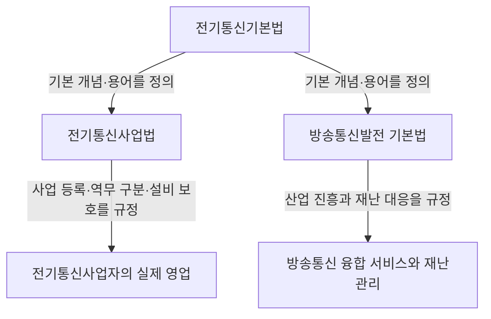

<Callout type="info">
  **이번 문서의 목표:** 전기통신기본법·전기통신사업법·방송통신발전 기본법이 왜 세 개로 나뉘어 있는지 그 역할 차이를 이해하고, 각 법의 목적·정의·핵심 조문(제1조·제2조 및 사업 구분·기본계획·벌칙 조문)의 번호와 수치를 정확히 짚어낼 수 있게 됩니다. 조문·수치는 2026년 9월 기준 국가법령정보센터(law.go.kr) 확인 내용을 따릅니다.
</Callout>

## 왜 법규를 알아야 하는가 — 시험이 아니라 실무의 언어

24편까지는 신호·회로·네트워크·서버라는 **기술**을 다뤘습니다. 이제부터는 그 기술을 실제로 설치하고 운영할 때 지켜야 하는 **규칙**을 다룹니다. 정보통신기사는 자격증인 동시에 법적으로 정해진 자격 요건입니다 — 일정 규모 이상의 정보통신공사는 이 자격을 가진 사람이 참여해야 하고, 통신설비를 함부로 훼손하면 처벌을 받으며, 통신 서비스를 제공하려면 정해진 절차를 거쳐 등록·신고해야 합니다. 이 모든 규칙의 근거가 법률이고, 그 법률들이 서로 다른 층위에서 역할을 나눠 맡고 있습니다.

> **쉽게 말하면:** 전기통신기본법은 "통신이란 무엇이고 왜 관리해야 하는가"를 정하는 헌법 같은 법이고, 전기통신사업법은 "통신 사업을 실제로 어떻게 운영하는가"를 정하는 실무법이며, 방송통신발전 기본법은 "방송과 통신이 융합된 산업을 어떻게 키우고 재난에서 지킬 것인가"를 정하는 산업진흥법입니다.

## 1. 세 법의 위치 관계

세 법은 아래처럼 목적이 겹치지 않게 역할을 나눠 갖습니다.

**왜 이렇게 나뉘어 있는가:** 1983년 옛 전기통신법이 폐지되면서 "기본 이념과 용어를 정하는 부분"과 "사업 운영 세칙을 정하는 부분"이 각각 전기통신기본법과 (당시) 공중전기통신사업법으로 갈라졌습니다. 이후 방송과 통신이 인터넷TV(IPTV)·모바일방송처럼 서로 융합되면서, 그 융합 산업을 진흥하고 재난에 대응하기 위한 별도의 법(방송통신발전 기본법)이 2010년에 새로 만들어졌습니다. 세 법 모두 소관 부처는 과학기술정보통신부이며, 방송 관련 정책 기능 일부는 방송통신위원회(2025년 정부조직 개편안에 따라 방송미디어통신위원회로 개편 예정)가 맡습니다.

## 2. 전기통신기본법 — 얼개만 정하는 법

### 목적과 정의 (제1조·제2조)

**전기통신기본법**(Framework Act on Telecommunications)의 **제1조**(목적)은 "전기통신에 관한 기본적인 사항을 정하여 전기통신을 효율적으로 관리하고 그 발전을 촉진함으로써 공공복리의 증진에 이바지함"이라고 밝힙니다. 여기서 핵심은 "기본적인 사항"이라는 표현입니다. 이 법은 세부 시행 방법을 정하지 않고, 뒤에 나오는 전기통신사업법과 그 시행령이 세부 사항을 정하도록 자리를 비켜 줍니다.

**제2조**(정의)는 이 과목 전체에서 반복해서 만나는 용어 여덟 가지를 정의합니다.

| 호 | 용어 | 정의 요지 |
|----|------|-----------|
| 1호 | 전기통신 | 유선·무선·광선 및 그 밖의 전자적 방식으로 부호·문언·음향 또는 영상을 송신하거나 수신하는 것 |
| 2호 | 전기통신설비 | 전기통신을 하기 위한 기계·기구·선로 및 그 밖에 전기통신에 필요한 설비 |
| 3호 | 전기통신회선설비 | 송신 장소와 수신 장소 사이를 연결하는 통신로를 구성하는 설비 |
| 4호 | 사업용전기통신설비 | 전기통신사업에 제공하기 위한 전기통신설비 |
| 5호 | 자가전기통신설비 | 특정인이 자신의 통신을 목적으로 설치한 전기통신설비 |
| 6호 | 전기통신기자재 | 전기통신설비에 사용되는 장치·기기·부품 또는 선조(線條) |
| 7호 | 전기통신역무 | 전기통신설비를 이용해 타인의 통신을 매개하거나 전기통신설비를 타인의 통신용으로 제공하는 것 |
| 8호 | 전기통신사업 | 전기통신역무를 제공하는 사업 |

**왜 이 여덟 개를 순서대로 외워야 하는가:** 정의들이 서로를 딛고 쌓입니다. 전기통신(1호)이 있어야 전기통신설비(2호)가 존재할 이유가 생기고, 그 설비 중 통신로를 잇는 부분이 회선설비(3호)이며, 그 설비를 누가 쓰느냐(사업용인가 자가용인가)로 4호·5호가 갈립니다. 그 설비를 남에게 제공하는 행위가 역무(7호)이고, 그 역무를 업으로 하는 것이 사업(8호)입니다. 즉 "설비 → 설비의 용도 → 그 설비로 하는 행위 → 그 행위를 하는 사업"이라는 하나의 흐름입니다.

**자주 틀리는 점:** 사업용전기통신설비와 자가전기통신설비를 "성능 차이"로 오해하는 경우가 많습니다. 실제로는 성능이 아니라 **누구를 위해 쓰는가**(불특정 다수에게 파는 용도인가, 자신만 쓰는 용도인가)가 구분 기준입니다.

### 기본계획 (제5조)

**제5조**(전기통신기본계획의 수립)는 정부(과학기술정보통신부장관)가 전기통신에 관한 기본계획을 수립·공고해야 한다고 정하고, 그 계획에 포함해야 할 사항으로 전기통신의 이용 효율화, 전기통신 질서의 유지, 전기통신사업, 전기통신설비, 전기통신기술의 진흥 등을 열거합니다. 계획 수립 시에는 관계 기관과 협의해야 합니다.

## 3. 전기통신사업법 — 사업의 실제 규칙

### 목적과 정의

**전기통신사업법**(Telecommunications Business Act)의 **제1조**(목적)은 "전기통신사업의 적절한 운영과 전기통신의 효율적 관리를 통하여 전기통신사업의 건전한 발전 및 이용자의 편의 도모"로 공공복리 증진에 이바지함을 밝힙니다. 전기통신기본법이 "무엇이 전기통신인가"를 정했다면, 이 법은 "그 전기통신을 사업으로 하려면 어떻게 해야 하는가"를 정합니다.

**제2조**(정의)는 스물여덟 개 항으로 이루어진 방대한 조문이며, 시험에 자주 나오는 세 가지만 정확히 잡아 둡니다.

| 용어 | 정의 요지 |
|------|-----------|
| 전기통신사업자 | 이 법에 따라 등록 또는 신고(신고가 면제된 경우를 포함)를 하고 전기통신역무를 제공하는 자 |
| 이용자 | 전기통신역무를 제공받기 위해 전기통신사업자와 이용 계약을 체결한 자 |
| 보편적 역무 | 모든 국민이 언제 어디서나 적절한 요금으로 제공받을 수 있어야 하는 기본적인 전기통신역무 |

**왜 "보편적 역무"라는 개념이 따로 있는가:** 통신 사업은 인구 밀집 지역일수록 수익성이 높습니다. 시장 논리에만 맡기면 산간·도서 지역은 통신망에서 소외될 수 있습니다. 이를 막기 위해 시내전화·긴급통신 같은 기본 역무는 국가가 "누구나 받을 수 있어야 한다"고 못 박고, 그 손실 일부를 사업자들이 분담(보편적 역무 손실보전금)하도록 설계했습니다.

### 전기통신사업의 구분 — 별정통신사업은 왜 사라졌는가

옛 전기통신사업법은 사업을 **기간통신사업**(회선설비를 직접 설치·운영), **별정통신사업**(기간통신사업자의 설비를 임차해 서비스 제공), **부가통신사업**(기간통신 역무 외의 부가 서비스 제공) 셋으로 나눴습니다. 그런데 2019년 개정으로 **별정통신사업 구분이 폐지**되어, 현재는 크게 **기간통신사업**과 **부가통신사업** 두 가지로 정리되었습니다.

**왜 폐지했는가:** 별정통신사업자 대부분이 이미 자체 설비 없이 회선을 임차해 재판매하는 형태로만 운영되고 있었고, 이는 실질적으로 부가통신사업의 성격과 겹쳤습니다. 규제 체계를 단순화해 신규 사업자의 시장 진입 부담(중복 등록·신고)을 줄이려는 목적이었습니다.

| 구분 | 정의 | 진입 절차 |
|------|------|-----------|
| 기간통신사업 | 전기통신회선설비를 설치·이용해 기간통신역무(전화·인터넷접속 등)를 제공하는 사업 | 등록(자본금·기술 인력 등 요건 심사) |
| 부가통신사업 | 기간통신역무 외의 부가통신역무(포털·메신저·클라우드 등)를 제공하는 사업 | 신고(일정 규모 이상만 대상, 대부분 신고 면제) |

**자주 틀리는 점:** "부가통신사업은 규제가 없다"고 오해하기 쉽지만, 일정 매출·이용자 규모 이상의 부가통신사업자는 서비스 안정성 확보 의무, 이용자 보호 의무 등 별도 규제(이른바 넷플릭스법 등)를 받습니다. 신고가 면제된다고 해서 규제 자체가 없는 것은 아닙니다.

### 설비의 설치·보전과 손괴 금지

전기통신사업자가 통신설비를 설치·운영하려면 타인의 토지를 일시적으로 이용해야 하는 경우가 생깁니다. 이를 위한 조문들이 있습니다.

| 조문 | 내용 |
|------|------|
| 제61조 | 전기통신사업자는 전기통신설비를 기술기준에 맞게 설치·유지·보수해야 한다 |
| 제62조 | 일정 규모 이상 중요 설비의 설치·변경은 신고 또는 승인 대상이다 |
| 제79조 | 누구든지 전기통신설비를 손괴하거나 물건을 첨가·이동해 통신을 방해해서는 안 된다 |

**왜 손괴 금지 조문이 따로 있는가:** 통신선로는 대부분 공공장소(가공선로·지중관로)에 설치되어 있어, 공사 중 실수나 고의로 손상되기 쉽습니다. 통신망은 한 지점의 단절이 수많은 이용자의 서비스 중단으로 번지는 특성(03편에서 배운 네트워크의 상호연결성)이 있으므로, 일반 재물손괴보다 더 엄격하게 다룹니다.

### 벌칙과 과징금

전기통신사업법은 통신 비밀 침해, 금지행위 위반, 설비 손괴 등에 대해 징역·벌금형을 두고, 사업자의 위반 행위에 대해서는 **관련 매출액의 일정 비율(최대 3퍼센트) 이하의 과징금**을 부과할 수 있는 별도 체계도 갖추고 있습니다. 과징금은 형벌이 아니라 행정제재이므로, 형사처벌과 별도로 또는 병행해 부과될 수 있습니다.

**자주 틀리는 점:** 과징금과 벌금을 같은 것으로 혼동하기 쉽습니다. 벌금은 법원이 형사재판으로 선고하는 형벌이고, 과징금은 행정기관(과학기술정보통신부 등)이 법 위반에 따른 경제적 이익을 환수하거나 제재하기 위해 부과하는 행정처분입니다.

## 4. 방송통신발전 기본법 — 공익성과 재난 대응

### 목적과 정의

**방송통신발전 기본법**(Framework Act on Broadcasting Communications Development)의 **제1조**(목적)은 "방송통신의 공익성·공공성을 보장하고 방송통신의 발전을 위한 기반을 조성함으로써 공공복리의 증진과 방송통신의 발전에 이바지함"입니다. **제2조**(정의)는 방송통신, 방송통신콘텐츠, 방송통신설비, 방송통신기자재, 방송통신서비스, 방송통신사업자 등을 정의하며, 앞선 두 법의 "전기통신" 자리에 "방송과 통신이 융합된 서비스"라는 더 넓은 개념을 채워 넣습니다.

**왜 방송과 통신을 하나의 법으로 묶었는가:** IPTV(인터넷TV)처럼 인터넷망(통신)으로 방송 콘텐츠를 전달하는 서비스가 등장하면서, "이것은 방송법이 규율할 대상인가 전기통신사업법이 규율할 대상인가"라는 경계가 모호해졌습니다. 방송통신발전 기본법은 이런 융합 서비스의 산업 진흥과 재난 대응이라는 공통분모를 하나의 법으로 다룹니다.

### 방송통신발전기본계획과 방송통신재난관리기본계획

| 조문 | 계획명 | 핵심 내용 |
|------|--------|-----------|
| 제8조 | 방송통신발전기본계획 | 방송통신서비스·콘텐츠·설비/망·기술진흥·보편적 서비스·국제협력 등을 포함해 수립 |
| 제35조–제37조 | 방송통신재난관리기본계획 | 방송통신재난관리기본계획의 수립·수립절차, 설비의 통합운용(재난 시 여러 사업자 설비를 함께 활용) |
| 제39조의2 | 재난관리책임자 지정 | 방송통신사업자에게 재난관리책임자 지정 의무 부여 |
| 제40조 | 재난방송 의무 | 방송사업자 등에게 재난 발생 시 재난방송을 실시할 의무 부여 |

**왜 재난관리 조문이 이렇게 자세한가:** 통신망은 재난 상황에서 구조·대피 정보 전달의 핵심 통로입니다. 태풍·지진·화재로 통신 기지국이나 국사(전화국)가 손상되면 그 지역 전체가 고립될 수 있으므로, 평상시 재난 대비 계획을 세우고 여러 사업자의 설비를 통합 운용할 수 있는 법적 근거를 미리 마련해 둔 것입니다.

### 방송통신발전기금

**제24조**는 방송통신발전기금의 설치를, **제25조**는 재원(정부출연금, 사업자로부터 징수한 분담금, 기금 운용 수익금 등)을, **제26조**는 용도(연구개발, 콘텐츠 제작 지원, 재난방송 지원 등)를, **제27조**는 기금의 관리·운용 주체를 정합니다.

**자주 틀리는 점:** 방송통신발전기금을 전기통신사업법의 "보편적 역무 손실보전금"과 혼동하기 쉽습니다. 손실보전금은 기간통신사업자가 오지 지역 서비스 제공 손실을 서로 나눠 메우는 좁은 목적의 분담금이고, 방송통신발전기금은 산업 진흥·재난 대응까지 아우르는 훨씬 넓은 목적의 기금입니다.

### 최신 개정 참고 — 소관 부처 개편

2025년 발표된 정부조직 개편안에 따라 방송통신위원회를 폐지하고 **방송미디어통신위원회**를 신설해 방송정책 기능과 과학기술정보통신부의 방송진흥정책 기능을 통합하는 절차가 진행되고 있습니다. 이 개편이 실제로 법제화되면 방송통신발전 기본법과 전기통신사업법 안의 소관 행정기관 표기가 바뀔 수 있으므로, 시험 응시 시점에는 국가법령정보센터에서 최신 시행 조문을 다시 확인하는 것이 안전합니다.

## 핵심 정리

- **전기통신기본법**은 얼개만 정하는 법으로, 제1조(목적)와 제2조(전기통신·전기통신설비·회선설비·사업용/자가전기통신설비·전기통신기자재·전기통신역무·전기통신사업 8개 정의)가 핵심이다.
- **전기통신사업법**은 실무 규칙을 정하는 법으로, 사업은 2019년 개정 이후 **기간통신사업·부가통신사업** 두 가지로 구분되며(별정통신사업 폐지), 설비 손괴 금지(제79조)와 매출액의 최대 3퍼센트 과징금 제도를 둔다.
- **방송통신발전 기본법**은 방송·통신 융합 산업의 진흥과 재난 대응을 다루며, 방송통신발전기본계획(제8조)·방송통신재난관리기본계획(제35조~)·방송통신발전기금(제24조~)이 핵심이다.
- 세 법은 "기본 개념 정의 → 사업 실무 규제 → 산업 진흥·재난 대응"으로 역할이 나뉘어 서로 겹치지 않는다.
- 법 조문·소관 부처는 개정·조직 개편으로 바뀔 수 있으므로 시험 직전 국가법령정보센터에서 최신 시행본을 확인해야 한다.

## 마무리 복습

<Quiz
  questionNumber={1}
  question="전기통신기본법 제2조의 정의 중 사업용전기통신설비와 자가전기통신설비를 구분하는 가장 정확한 기준은?"
  options={['전송 속도와 대역폭의 차이', '설비를 누구를 위해 사용하는가(불특정 다수용인가 자신만의 용도인가)', '유선인가 무선인가의 차이', '실외 설치인가 실내 설치인가의 차이']}
  correctAnswer={2}
  explanation="사업용전기통신설비는 전기통신사업에 제공하기 위한 설비이고 자가전기통신설비는 특정인이 자신의 통신 목적으로 설치한 설비이므로, 구분 기준은 성능이나 설치 위치가 아니라 사용 목적(누구를 위한 것인가)이다."
  optionExplanations={['전송 속도나 대역폭은 이 두 용어를 구분하는 법적 기준이 아니다.', '사업용과 자가용의 구분 기준은 정확히 사용 목적(불특정 다수 제공용인가 자신의 용도인가)이다.', '유선·무선 여부는 전기통신 자체의 방식이며 사업용·자가용 구분과는 무관하다.', '설치 위치는 이 두 용어의 정의에 등장하지 않는 기준이다.']}
/>

<Quiz
  questionNumber={2}
  question="전기통신기본법과 전기통신사업법의 관계에 대한 설명으로 가장 적절한 것은?"
  options={['두 법은 같은 내용을 서로 다른 표현으로 반복해서 규정한다', '전기통신기본법은 기본 개념과 이념을, 전기통신사업법은 사업 운영의 세부 규칙을 규정한다', '전기통신사업법이 상위법이고 전기통신기본법이 그 하위 시행령 역할을 한다', '두 법은 적용 대상 산업이 전혀 달라 서로 아무런 관련이 없다']}
  correctAnswer={2}
  explanation="전기통신기본법은 전기통신에 관한 기본적인 사항(개념 정의, 기본계획)만을 정하고 구체적인 사업 운영 방식은 전기통신사업법이 정하도록 역할을 나눈 구조다."
  optionExplanations={['두 법은 내용이 겹치지 않도록 역할을 나눈 구조이지 같은 내용의 반복이 아니다.', '기본 개념·이념과 사업 운영 세칙으로 역할이 나뉜다는 설명이 정확하다.', '두 법은 국회가 제정한 별개의 법률로 상하위 관계(법률과 시행령)에 있지 않다.', '두 법 모두 전기통신이라는 같은 산업을 규율하며 서로 밀접하게 연관되어 있다.']}
/>

<Quiz
  questionNumber={3}
  question="2019년 전기통신사업법 개정으로 별정통신사업 구분이 폐지된 이후, 현재 전기통신사업의 분류로 옳은 것은?"
  options={['기간통신사업과 특수통신사업', '기간통신사업과 부가통신사업', '별정통신사업과 부가통신사업', '기간통신사업, 별정통신사업, 부가통신사업 세 가지 모두 유지']}
  correctAnswer={2}
  explanation="2019년 개정으로 별정통신사업 구분이 폐지되면서 현재는 전기통신회선설비를 직접 설치·운영하는 기간통신사업과, 그 외의 부가통신역무를 제공하는 부가통신사업 두 가지로 정리되었다."
  optionExplanations={['특수통신사업이라는 분류는 전기통신사업법에 존재하지 않는다.', '별정통신사업 폐지 이후 기간통신사업과 부가통신사업 두 가지로 분류되므로 옳다.', '별정통신사업 자체가 폐지되었으므로 이 조합은 성립하지 않는다.', '별정통신사업은 2019년 개정으로 이미 폐지되어 세 가지가 모두 유지되지 않는다.']}
/>

<Quiz
  questionNumber={4}
  question="전기통신사업법상 보편적 역무 제도를 두는 이유로 가장 적절한 것은?"
  options={['사업자의 광고 마케팅 비용을 절감하기 위해', '수익성이 낮은 지역도 기본적인 통신 서비스를 받을 수 있도록 보장하기 위해', '통신 요금을 지역과 무관하게 완전히 동일하게 고정하기 위해', '외국 사업자의 국내 시장 진입을 제한하기 위해']}
  correctAnswer={2}
  explanation="보편적 역무는 시장 논리로는 소외되기 쉬운 산간·도서 지역에도 모든 국민이 적절한 요금으로 기본 전기통신역무를 받을 수 있도록 보장하기 위한 제도다."
  optionExplanations={['보편적 역무는 마케팅 비용과 관련이 없는 이용자 보호 제도다.', '수익성이 낮은 지역도 기본 서비스에서 소외되지 않도록 보장한다는 설명이 정확하다.', '보편적 역무는 요금을 전국 완전 동일가로 고정하는 제도가 아니라 접근성과 손실보전을 다루는 제도다.', '외국 사업자 진입 제한과는 무관한 이용자 보호·형평성 제도다.']}
/>

<Quiz
  questionNumber={5}
  question="전기통신사업법 제79조가 정하는 내용으로 가장 적절한 것은?"
  options={['전기통신사업자의 등록 절차', '누구든지 전기통신설비를 손괴하거나 통신을 방해하는 행위의 금지', '보편적 역무 손실보전금의 분담 비율', '전기통신기본계획의 수립 주기']}
  correctAnswer={2}
  explanation="제79조는 전기통신설비의 손괴, 물건의 첨가·이동을 통한 통신 방해 행위를 누구든지 해서는 안 된다고 정하는 설비 보호 조문이다."
  optionExplanations={['등록 절차는 사업자 진입 요건을 다루는 별도 조문의 내용이다.', '설비 손괴와 통신 방해 금지가 제79조의 정확한 내용이다.', '손실보전금 분담은 보편적 역무 관련 별도 규정에서 다룬다.', '기본계획 수립은 전기통신기본법 제5조에서 다루는 내용이다.']}
/>

<Quiz
  questionNumber={6}
  question="전기통신사업법의 벌금과 과징금에 대한 설명으로 옳지 않은 것은?"
  options={['벌금은 법원이 형사재판을 통해 선고하는 형벌이다', '과징금은 행정기관이 부과하는 행정제재로 형벌과는 성격이 다르다', '전기통신사업법은 사업자의 금지행위 위반에 관련 매출액의 일정 비율 이하 과징금을 부과할 수 있다', '과징금이 부과되면 동일 사안에 대해 형사처벌은 절대 함께 이루어질 수 없다']}
  correctAnswer={4}
  explanation="과징금은 행정제재이고 형사처벌은 별개의 절차이므로, 사안에 따라 과징금과 형사처벌이 함께 이루어질 수 있다. 둘이 절대 양립할 수 없다는 서술은 옳지 않다."
  optionExplanations={['벌금이 법원의 형사재판을 통한 형벌이라는 설명은 옳다.', '과징금이 행정기관의 행정제재라는 설명은 옳다.', '금지행위 위반에 매출액 비율 기준 과징금을 부과할 수 있다는 설명은 옳다.', '과징금과 형사처벌은 성격이 다른 별개 절차이므로 함께 이루어질 수 없다는 단정은 옳지 않다.']}
/>

<Quiz
  questionNumber={7}
  question="방송통신발전 기본법에 관한 설명으로 옳지 않은 것은?"
  options={['방송통신서비스·콘텐츠·설비의 진흥뿐 아니라 방송통신재난관리기본계획도 함께 규정한다', '방송통신발전기금은 연구개발·콘텐츠 제작 지원·재난방송 지원 등에 쓰인다', '이 법은 방송법과 전기통신사업법을 완전히 대체해 두 법을 폐지시켰다', '방송통신사업자에게 재난관리책임자 지정 의무를 부여하는 조문을 둔다']}
  correctAnswer={3}
  explanation="방송통신발전 기본법은 방송·통신 융합 산업의 진흥과 재난 대응을 다루는 별도의 법으로, 기존의 방송법이나 전기통신사업법을 대체하거나 폐지한 것이 아니라 세 법이 함께 존재한다."
  optionExplanations={['진흥 계획과 재난관리기본계획을 함께 규정한다는 설명은 옳다.', '기금의 용도에 대한 설명은 옳다.', '이 법은 방송법·전기통신사업법을 폐지하지 않고 별도로 병존하므로 이 서술이 옳지 않다.', '재난관리책임자 지정 의무 조문(제39조의2)이 실제로 존재하므로 옳은 설명이다.']}
/>

## 참고 자료

- [계명대학교 게시판 - 정보통신기사 출제기준(필기·실기) PDF](https://cms.kmu.ac.kr/bbs/computer/763/172569/download.do)
- [한국방송통신전파진흥원(KCA) - 출제기준 자료실](https://www.cq.or.kr/qh_cusgm10_001.do)
- [국가법령정보센터 - 전기통신기본법](https://www.law.go.kr/lsInfoP.do?lsiSeq=93612)
- [국가법령정보센터 - 전기통신사업법](https://www.law.go.kr/LSW/lsInfoP.do?lsiSeq=268545)
- [국가법령정보센터 - 방송통신발전 기본법](https://www.law.go.kr/lsEfInfoP.do?lsiSeq=202276)
