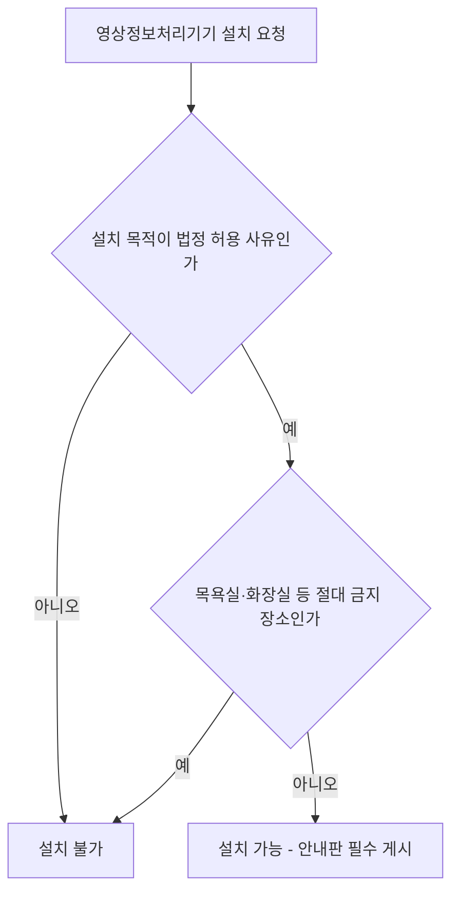

<Callout type="info">
  **이번 문서의 목표:** 개인정보보호법 제25조가 정하는 영상정보처리기기(CCTV)의 설치 제한·금지 장소·안내판 의무를 정확히 알고, 공동주택관리법령상 CCTV 설치 의무가 발생하는 세대수 기준을 계산할 수 있으며, 정보통신공사의 설계도서 구성 요소와 감리 절차의 흐름을 순서대로 설명할 수 있게 됩니다. 조문·수치는 2026년 9월 기준 국가법령정보센터(law.go.kr) 확인 내용을 따릅니다.
</Callout>

## 왜 CCTV는 통신 법규 시험에 나오는가

14편에서 CCTV·IP카메라 같은 영상정보처리기기를 통신망(랜선·PoE)으로 연결하는 기술을 다뤘습니다. 이 편은 그 설비를 **어디에 설치해도 되는지, 얼마나 많은 세대가 모이면 설치 의무가 생기는지**를 법적으로 정리합니다. 정보통신기사가 실무에서 CCTV 설치 공사를 설계·시공·감리할 때 가장 자주 마주치는 민원이 바로 "이 카메라, 이 자리에 달아도 되나요?"이기 때문에 이 영역은 정보설비기준 과목의 "정보통신 법규 해석" 항목에 명시적으로 포함되어 있습니다.

> **쉽게 말하면:** CCTV는 기술적으로 달 수 있어도 개인정보보호법이 정한 자리에는 달 수 없고, 아파트는 세대수가 일정 규모를 넘으면 CCTV를 반드시 달아야 합니다.

## 1. 개인정보보호법 — 영상정보처리기기의 설치·운영 제한 (제25조)

### 설치가 허용되는 경우

개인정보보호법 **제25조**(고정형 영상정보처리기기의 설치·운영 제한)는 공개된 장소에 영상정보처리기기를 설치·운영하는 것을 원칙적으로 금지하고, 다음 목적일 때만 예외적으로 허용합니다.

| 허용 목적 | 예시 |
|-----------|------|
| 범죄의 예방 및 수사 | 골목길·주차장 방범 카메라 |
| 시설안전 및 관리, 화재 예방 | 건물 출입구·기계실 감시 |
| 교통단속 | 신호위반·속도위반 단속 카메라 |
| 교통정보의 수집·분석·제공 | 교통량 조사 카메라 |
| 촬영된 영상정보를 저장하지 않는 경우 | 실시간 확인용으로만 쓰고 녹화하지 않는 경우 |

### 설치가 금지되는 장소

**목욕실, 화장실, 발한실, 탈의실 등 사생활 침해 우려가 큰 공간의 내부**를 볼 수 있는 위치에는, 위 예외 목적이 있더라도 영상정보처리기기를 설치·운영할 수 없습니다.

**왜 이렇게 이중으로 규제하는가:** 첫 번째 규제(설치 목적 제한)는 "아무 이유 없이 감시하지 마라"는 규칙이고, 두 번째 규제(장소 절대 금지)는 "정당한 목적이 있어도 이 장소만큼은 예외 없이 안 된다"는 규칙입니다. 목욕실·탈의실처럼 신체 노출이 예상되는 공간은 범죄 예방 목적이라 해도 사생활 침해가 그 이익보다 압도적으로 크다고 법이 미리 판단해 둔 것입니다.

### 안내판 설치 의무

영상정보처리기기 운영자는 정보주체(촬영 대상이 되는 사람)가 쉽게 알아볼 수 있도록 안내판을 설치해야 합니다. 범죄 예방 목적으로 설치하는 경우 안내판에는 최소한 다음 사항이 포함되어야 합니다.

| 안내판 필수 기재 사항 |
|------------------------|
| 설치 목적 및 장소 |
| 촬영 범위 및 시간 |
| 관리책임자의 성명 및 연락처 |

**자주 틀리는 점:** "CCTV 촬영 중"이라는 문구나 카메라 모양 스티커 하나만 붙여 놓는 것은 개인정보보호법이 요구하는 안내판으로 인정되지 않습니다. 목적·장소·촬영범위·시간·관리책임자 연락처까지 갖춰야 정식 안내판입니다.

## 2. 공동주택관리법 — CCTV 설치 의무 세대 기준

공동주택관리법 시행령과 주택건설기준 등에 관한 규정은 보안·방범 목적의 영상정보처리기기(폐쇄회로 텔레비전, CCTV) 설치를 의무화하는 아파트 단지 기준을 정합니다.

| 구분 | 설치 의무 발생 조건 |
|------|----------------------|
| 세대수 기준 | 300세대 이상의 아파트 |
| 승강기 설치 기준 | 150세대 이상이면서 승강기가 설치된 아파트 |
| 중앙집중식 난방 기준 | 150세대 이상이면서 중앙집중식 난방방식(지역난방 포함)인 아파트 |
| 복합건축물 기준 | 건축법상 건축허가를 받아 주택 외 시설과 주택을 같은 건축물로 지은 경우로서 주택이 150세대 이상인 건축물 |

**왜 기준이 두 갈래(300세대, 150세대)로 나뉘는가:** 단순히 세대수만으로 보면 300세대가 기준이지만, 승강기나 중앙난방설비처럼 공용 설비를 많이 쓰는 단지는 외부인 출입이나 시설 관리 위험이 더 크다고 보아 150세대라는 더 낮은 기준을 적용합니다. 즉 "공용 설비의 위험도가 높을수록 더 적은 세대수에서도 설치 의무가 발생한다"는 논리입니다.

**적용 사례.** 승강기가 설치된 200세대 아파트는 300세대 기준에는 못 미치지만, "150세대 이상이면서 승강기 설치"라는 별도 기준을 충족하므로 CCTV 설치 의무가 발생합니다. 반대로 승강기도 없고 중앙난방도 아닌 200세대 아파트는 300세대 기준에도, 150세대 기준에도 해당하지 않아 이 규정상 의무 설치 대상은 아닙니다.

**자주 틀리는 점:** "150세대 이상"이라는 조건 하나만 외우고 승강기·중앙난방이라는 부가 조건을 빠뜨리는 실수가 흔합니다. 150세대라는 숫자는 반드시 승강기 또는 중앙집중식 난방이라는 조건과 함께 붙어 있어야 성립합니다.

## 3. 정보통신공사의 종류와 설계도서

### 공사의 종류

정보통신공사는 목적에 따라 다음과 같이 구분합니다.

| 공사 종류 | 내용 |
|-----------|------|
| 신설 | 기존에 없던 정보통신설비를 새로 설치 |
| 증설 | 기존 설비의 용량이나 규모를 늘림 |
| 개설 | 새로운 서비스를 위해 설비를 갖춰 서비스를 시작 |
| 변경 | 기존 설비의 사양·구성을 바꿈 |
| 이설 | 설비의 설치 위치를 옮김 |
| 제거(철거) | 설비를 걷어 내어 없앰 |

### 설계도서의 3요소

정보통신공사를 발주하려면 아래 세 가지를 갖춘 **설계도서**가 있어야 합니다.

| 구성 요소 | 내용 |
|-----------|------|
| 설계도면 | 설비의 배치·배선·계통을 그림으로 표현한 도면 |
| 설계설명서 | 공법·자재·시공 기준 등을 문장으로 설명한 서류 |
| 공사내역서(공사비 내역서) | 항목별 물량과 단가를 산출해 공사비를 계산한 서류 |

**왜 세 가지가 모두 필요한가:** 도면만 있으면 "어디에 무엇을 놓을지"는 알 수 있지만 "어떤 자재와 시공 방법을 쓸지", "비용이 얼마인지"는 알 수 없습니다. 세 서류가 합쳐져야 발주자가 정확한 예산을 세우고, 시공자가 정확히 같은 기준으로 시공하며, 감리원이 그 기준대로 되었는지 검사할 수 있는 근거가 완성됩니다.

## 4. 감리의 절차와 산출물

정보통신공사 감리는 다음과 같은 흐름으로 진행됩니다.

| 단계 | 감리원의 역할 |
|------|----------------|
| 착공 전 | 설계도서 검토, 시공계획서 확인 |
| 시공 중 | 단계별 확인·검사, 자재 품질 점검, 안전관리 지도 |
| 준공 시 | 준공검사 참여, 설계도서와 실제 시공의 일치 여부 확인 |
| 준공 후 | 감리보고서 작성, 발주자에게 제출 |

**왜 감리원이 시공사와 별개로 필요한가:** 시공사는 공사비를 적게 들이고 빨리 끝내려는 유인이 있는 반면, 발주자는 그 공사가 설계도서와 기술기준대로 제대로 됐는지 확인할 전문성이 부족한 경우가 많습니다. 감리원은 발주자를 대신해 현장에서 시공 품질을 확인하는 제3의 전문가 역할을 합니다. 26편에서 다룬 감리원 배치기준(공사금액별 등급)이 바로 이 감리 업무를 수행할 사람의 자격을 정한 것입니다.

**자주 틀리는 점:** 감리를 "공사가 끝난 뒤 검사만 하는 절차"로 오해하기 쉽지만, 실제로는 착공 전 설계도서 검토부터 시공 중 단계별 확인, 준공 후 보고서 작성까지 공사 전체 기간에 걸쳐 이루어지는 지속적인 관리 활동입니다.

## 핵심 정리

- 개인정보보호법 제25조는 영상정보처리기기 설치를 범죄예방·시설안전·교통단속 등 법정 목적일 때만 허용하고, 목욕실·화장실·탈의실 등은 목적과 무관하게 절대 설치 금지 장소로 정한다.
- 안내판에는 설치 목적·장소, 촬영 범위·시간, 관리책임자 연락처가 반드시 포함되어야 한다.
- 공동주택관리법령상 CCTV 설치 의무는 **300세대 이상** 또는 **150세대 이상이면서 승강기·중앙집중식 난방**을 갖춘 아파트에서 발생한다.
- 정보통신공사는 신설·증설·개설·변경·이설·제거로 구분되며, 설계도서는 설계도면·설계설명서·공사내역서 세 가지로 구성된다.
- 감리는 착공 전 설계도서 검토부터 시공 중 단계별 확인, 준공검사, 감리보고서 작성까지 공사 전 기간에 걸친 지속적 활동이다.

## 마무리 복습

<Quiz
  questionNumber={1}
  question="개인정보보호법 제25조에 따라 정당한 목적이 있어도 영상정보처리기기 설치가 절대적으로 금지되는 장소는?"
  options={['건물 출입구', '주차장', '목욕실 내부', '신호등이 설치된 교차로']}
  correctAnswer={3}
  explanation="목욕실·화장실·발한실·탈의실 등 사생활 침해 우려가 큰 공간의 내부는 범죄 예방 등 정당한 목적이 있더라도 예외 없이 설치가 금지된다."
  optionExplanations={['건물 출입구는 시설안전·범죄예방 목적으로 설치가 허용되는 대표적 장소다.', '주차장 역시 범죄예방 목적으로 설치가 허용되는 대표적 장소다.', '목욕실 내부는 목적과 무관하게 절대적으로 설치가 금지되는 장소다.', '교차로는 교통단속·교통정보 수집 목적으로 설치가 허용되는 장소다.']}
/>

<Quiz
  questionNumber={2}
  question="개인정보보호법이 요구하는 영상정보처리기기 안내판에 반드시 포함되어야 하는 사항으로 옳지 않은 것은?"
  options={['설치 목적 및 장소', '촬영 범위 및 시간', '관리책임자의 성명 및 연락처', '촬영된 영상을 저장하는 서버의 제조사명']}
  correctAnswer={4}
  explanation="안내판 필수 기재 사항은 설치 목적 및 장소, 촬영 범위 및 시간, 관리책임자의 성명 및 연락처이며 저장 서버의 제조사명은 요구되지 않는다."
  optionExplanations={['설치 목적 및 장소는 안내판 필수 기재 사항이다.', '촬영 범위 및 시간은 안내판 필수 기재 사항이다.', '관리책임자의 성명 및 연락처는 안내판 필수 기재 사항이다.', '저장 서버의 제조사명은 개인정보보호법이 요구하는 안내판 기재 사항에 해당하지 않는다.']}
/>

<Quiz
  questionNumber={3}
  question="승강기가 설치된 200세대 아파트에 공동주택관리법령상 CCTV 설치 의무가 발생하는지에 대한 설명으로 옳은 것은?"
  options={['300세대 미만이므로 어떤 경우에도 설치 의무가 없다', '150세대 이상이면서 승강기가 설치되어 있으므로 설치 의무가 발생한다', '승강기 설치 여부와 무관하게 300세대 이상만 기준이 된다', '중앙집중식 난방이 아니므로 설치 의무가 없다']}
  correctAnswer={2}
  explanation="공동주택관리법령은 300세대 이상 기준 외에도 150세대 이상이면서 승강기가 설치된 경우를 별도의 설치 의무 기준으로 두므로, 200세대에 승강기가 설치되어 있으면 이 기준으로 설치 의무가 발생한다."
  optionExplanations={['300세대 기준 외에 150세대와 승강기를 조합한 별도 기준이 존재하므로 이 서술은 옳지 않다.', '150세대 이상과 승강기 설치라는 두 조건을 모두 충족하므로 설치 의무가 발생한다는 설명이 정확하다.', '승강기 설치 여부도 별도의 독립적인 기준이 되므로 300세대만이 유일한 기준이라는 서술은 옳지 않다.', '중앙집중식 난방 기준은 승강기 기준과 별개의 또 다른 기준일 뿐이며, 승강기 기준 자체는 난방 방식과 무관하게 성립한다.']}
/>

<Quiz
  questionNumber={4}
  question="정보통신공사의 설계도서를 구성하는 세 가지 요소로 옳은 것은?"
  options={['설계도면, 설계설명서, 공사내역서', '설계도면, 감리보고서, 준공검사서', '시공계획서, 착공신고서, 준공도서', '등록증, 사업자등록증, 기술인력 명부']}
  correctAnswer={1}
  explanation="설계도서는 배치·배선을 그림으로 표현한 설계도면, 공법·자재·시공 기준을 설명한 설계설명서, 물량과 단가로 공사비를 산출한 공사내역서 세 가지로 구성된다."
  optionExplanations={['설계도면, 설계설명서, 공사내역서 세 가지가 설계도서의 정확한 구성이다.', '감리보고서와 준공검사서는 공사가 진행된 이후에 만들어지는 문서로 설계도서 자체가 아니다.', '시공계획서와 착공신고서는 착공 단계의 문서이며 준공도서는 공사 완료 후 문서이므로 설계도서와는 다르다.', '등록증이나 사업자등록증은 공사업체의 자격을 증명하는 서류이지 설계도서가 아니다.']}
/>

<Quiz
  questionNumber={5}
  question="정보통신공사 감리의 업무 범위에 대한 설명으로 가장 적절한 것은?"
  options={['공사가 끝난 뒤 준공검사에서만 관여하는 절차다', '착공 전 설계도서 검토부터 시공 중 확인, 준공 후 보고서 작성까지 공사 전 기간에 걸친 활동이다', '시공사가 직접 자신의 공사를 스스로 감리하는 절차다', '감리원은 발주자의 요청이 있을 때만 현장에 방문하면 되는 자문 역할이다']}
  correctAnswer={2}
  explanation="감리는 착공 전 설계도서 검토, 시공 중 단계별 확인과 안전관리 지도, 준공검사 참여, 감리보고서 작성까지 공사 전 기간에 걸쳐 이루어지는 지속적인 활동이다."
  optionExplanations={['준공검사에만 관여한다는 설명은 착공 전·시공 중 업무를 빠뜨린 것으로 옳지 않다.', '착공 전부터 준공 후까지 이어지는 전 기간 활동이라는 설명이 정확하다.', '감리는 시공사와 별개인 제3자 전문가가 발주자를 대신해 수행하는 업무다.', '감리원은 합의된 기간 동안 현장에 상주하는 것이 원칙이며 요청이 있을 때만 방문하는 자문 역할이 아니다.']}
/>

<Quiz
  questionNumber={6}
  question="기존에 설치된 정보통신설비의 용량이나 규모를 늘리는 공사를 가리키는 용어로 옳은 것은?"
  options={['신설', '증설', '이설', '제거']}
  correctAnswer={2}
  explanation="증설은 기존 설비의 용량이나 규모를 늘리는 공사를 가리키며, 신설은 없던 설비를 새로 만드는 것, 이설은 위치를 옮기는 것, 제거는 없애는 것을 가리킨다."
  optionExplanations={['신설은 기존에 없던 설비를 새로 설치하는 것을 가리킨다.', '기존 설비의 용량·규모를 늘리는 공사를 정확히 가리키는 용어다.', '이설은 설비의 위치를 옮기는 공사를 가리킨다.', '제거(철거)는 설비를 없애는 공사를 가리킨다.']}
/>

## 참고 자료

- [계명대학교 게시판 - 정보통신기사 출제기준(필기·실기) PDF](https://cms.kmu.ac.kr/bbs/computer/763/172569/download.do)
- [한국방송통신전파진흥원(KCA) - 출제기준 자료실](https://www.cq.or.kr/qh_cusgm10_001.do)
- [국가법령정보센터 - 개인정보 보호법 제25조](https://www.law.go.kr/LSW//lsLawLinkInfo.do?lsJoLnkSeq=900079397&lsId=011357&chrClsCd=010202)
- [찾기쉬운 생활법령정보 - 영상정보처리기기 설치·운영 제한](https://www.easylaw.go.kr/CSP/CnpClsMain.laf?csmSeq=1257&ccfNo=2&cciNo=3&cnpClsNo=3)
- [국가법령정보센터 - 정보통신공사업법 시행령](https://www.law.go.kr/LSW/lsInfoP.do?lsiSeq=279107)
