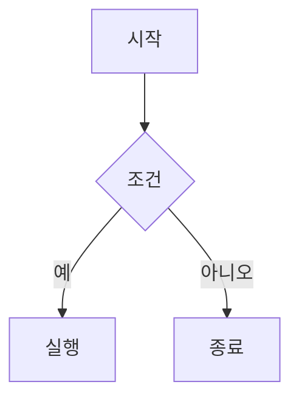

# 기술 스택 가이드

이 문서는 사이트를 구성하는 프레임워크·컴포넌트·라이브러리의 지도입니다.
MDX 작성 시 지켜야 하는 문법 금지 규칙은 [prompts/05_최종완성.md](../prompts/05_최종완성.md)에 있습니다.

## 프레임워크

| 기술 | 역할 | 비고 |
|------|------|------|
| Next.js 15 | 앱 프레임워크 | `output: 'export'` 정적 사이트 빌드 |
| Nextra 4 (+ nextra-theme-docs) | 문서 사이트 엔진 | `content/`의 MDX를 페이지로 렌더링 |
| React 19 | UI | |
| TypeScript 5 | 타입 | |
| Tailwind CSS 4 | 스타일 | `@tailwindcss/postcss` |
| Pagefind | 전문 검색 | `postbuild` 스크립트에서 인덱스 생성 |

- 라우팅: `app/[[...mdxPath]]/page.tsx`가 `content/` 경로를 그대로 URL로 매핑
- 수식: `next.config.ts`의 `nextra({ latex: { renderer: 'katex' } })` — KaTeX 내장 렌더링 (`$...$`, `$$...$$`)

## 전역 컴포넌트 (import 없이 MDX에서 바로 사용)

`mdx-components.tsx`에 등록되어 있습니다. 새 컴포넌트를 추가하면 여기에도 등록해야 전역으로 쓸 수 있습니다.

### Nextra 기본 컴포넌트

| 컴포넌트 | 용도 |
|----------|------|
| `Callout` | 중요 설명·주의사항 (`type="info"`, `"warning"`, `"error"`) |
| `Table` | 비교표 |
| `Tabs` / `Tabs.Tab` | 탭 전환 (내부적으로 `docs-tabs.tsx` 래퍼 사용) |
| `Steps` | 단계별 과정 |
| `Collapse` | 접었다 펼치는 설명 |
| `Cards` | 문서 링크 카드 |
| `FileTree` | 폴더 구조 표현 |

### 커스텀 컴포넌트 (`app/components/`)

| 컴포넌트 | 파일 | 용도 |
|----------|------|------|
| `Quiz` | `quiz.tsx` + `quiz-text.tsx` | 4지선다 퀴즈 (정답·해설 표시). 문자열 prop 안에서 `$...$` 수식, `` `code` ``, `**강조**`, 줄바꿈·마크다운 표·들여쓴 출력 블록을 직접 렌더링 |
| `CodePlayground` | `code-playground.tsx` | Sandpack 기반 JS·React 코드 편집·실행 |
| `OneDriveVideo` | `one-drive-video.tsx` | OneDrive 학습 영상 iframe 삽입 |
| `DataBarChart` | `data-bar-chart.tsx` | Recharts 기반 차트 |
| `SetDiagram` | `set-diagram.tsx` | JSXGraph 기반 수학 그래프·도형 |
| `ConceptFlow` | `concept-flow.tsx` | React Flow 기반 노드 흐름도 |
| `HomeLanding` | `home-landing.tsx` | 홈 랜딩 (문서용 아님, 홈 전용) |

#### Quiz 문자열 prop 작성 규칙

Quiz의 `question`·`explanation`·`options`·`optionExplanations`는 MDX 본문이 아니라 **문자열 prop**이라 MDX 파이프라인을 거치지 않는다. 문자열이 어느 문법으로 해석되는지가 표기 방식에 따라 다르므로 아래를 지킨다.

| 표기 | 해석 주체 | 규칙 |
|------|-----------|------|
| `question="..."` (JSX 문자열 속성) | MDX | 역슬래시 이스케이프를 처리하지 않는다. `\\ls`라고 쓰면 화면에 `\\ls`가 그대로 나오므로 **역슬래시는 한 번만** 쓴다(`\ls`, `\0`, `\nabla`). `&lt;` 같은 문자 참조는 `<`로 바뀐다. `\n`은 줄바꿈이 아니라 글자 그대로다 |
| `question={"..."}`, `options={['...']}` (JS 표현식) | JavaScript | 일반 JS 문자열 규칙. 역슬래시 하나를 보이려면 `\\`, 줄바꿈은 `\n`, 작은따옴표는 `\'`. `&lt;`·`&quot;` 같은 문자 참조는 **글자 그대로 출력**되므로 쓰지 말고 `<`·`"`를 직접 쓴다 |

- 문제에 코드가 두 문장 이상 들어가면 한 줄로 늘어놓지 말고 `question={"다음 코드의 실행 결과는?\n\n```java\nint a = 3;\nint b = a++;\n```"}`처럼 산문 뒤에 코드 펜스(` ```언어 `)를 둔다. 펜스는 `pre` 블록으로 렌더링된다.
- 줄바꿈이나 표·프로그램 출력을 문제에 넣어야 하면 `question={"첫 줄\n\n| a | b |\n| --- | --- |\n| 1 | 2 |"}`처럼 JS 문자열로 쓴다. 빈 줄로 문단이 나뉘고, 마크다운 표는 표로, 들여쓰기가 있는 여러 줄은 `pre` 블록으로 렌더링된다.
- `$...$`는 여는 `$` 뒤와 닫는 `$` 앞에 공백이 없을 때만 수식이며, 안에 한글이 들어가면 수식으로 보지 않는다. `$SHELL`, `$0`, `$5` 같은 셸 변수·가격 표기는 그대로 써도 된다.

## 시각화 라이브러리 ↔ 래퍼 매핑

라이브러리를 MDX에서 직접 import하지 않습니다. 반드시 아래 래퍼 컴포넌트를 거칩니다.

| 라이브러리 | 래퍼 | 적합한 상황 |
|-----------|------|-------------|
| KaTeX | (내장, 래퍼 없음) | 수학·통계 공식 |
| Mermaid | (내장, ` ```mermaid ` 코드펜스) | 흐름도·시퀀스·클래스·ER 다이어그램 등 정적 구조 표현 |
| Recharts | `data-bar-chart.tsx` | 데이터 비교·분포 차트 |
| JSXGraph | `set-diagram.tsx` | 함수·벡터·도형 직접 조작 |
| React Flow (`@xyflow/react`) | `concept-flow.tsx` | 사용자가 노드를 움직여야 의미가 있을 때만 |
| Sandpack (`@codesandbox/sandpack-react`) | `code-playground.tsx` | JS·React 코드 실습 |
| gsap | `home-landing.tsx` | 홈 랜딩 애니메이션 전용 — 학습 문서에서 사용 금지 |

**Mermaid 사용법** (2026-08-29 검증 완료 — nextra 4 내장, 별도 설치·import 불필요):

````mdx

````

- 클라이언트에서 렌더링되며 다크 모드를 자동으로 따라간다.
- 과거 "mermaid가 조용히 사라진다"는 기록이 있었으나, 이는 `_meta.js`가 깨진 상태에서 테스트한 오진으로 확인됨. 정상 작동한다.
- 역할 구분: **정적 구조·흐름 = Mermaid**, **사용자가 노드를 조작해야 의미 있는 흐름 = ConceptFlow**.

**주의:**

- 모든 시각화를 한 문서에 억지로 넣지 않습니다. 이해에 실질적으로 도움이 될 때만 사용합니다.
- `better-react-mathjax`는 사용처가 없어 제거되었습니다. 수식은 KaTeX만 사용합니다.

## 명령어

```bash
npm run dev     # 개발 서버 (localhost:3000)
npm run build   # 정적 빌드 + postbuild에서 Pagefind 검색 인덱스 생성
```

빌드 성공 여부만 믿지 말 것 — 볼드 렌더링 깨짐 등 일부 문제는 빌드를 통과하므로 브라우저에서 직접 확인이 필요합니다.
